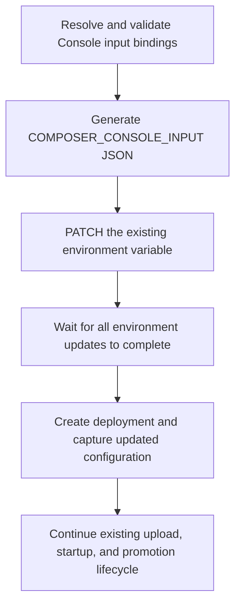

# Design brief: complete environment updates before deployment creation

## Purpose

Ensure that a Composer deployment captures its intended environment configuration.
This is the direct fix for the configuration ordering bug and can ship independently
of the application readiness proposal, which is tracked separately.

Prisma Compute snapshots environment variables when a deployment is created.
Updating those variables afterward does not change the deployment's configuration.
Composer must finish its environment updates before creating the deployment.

The Console migration exposed a violation of this ordering: a deployment received
the previous 51-field input document instead of the required 57-field document.
Runtime validation failed before the server started.

A local probe confirms the dependency issue. Composer currently depends on
variable IDs, which Alchemy, the deployment engine, can resolve from persisted
state while value updates remain pending. Depending on the whole resource preserves
the dependency. The existing 12 deployment-edge tests pass but do not cover this
persisted-state failure. A complete lifecycle regression test remains required.

## At a glance

1. **Preserve dependencies on resource completion.** Change `appAfterEnvironment()`
   to reference whole environment resources rather than their stable IDs.
2. **Keep replacement detection unchanged.** Existing environment triggers determine
   whether a new deployment is needed; the corrected dependency determines when
   creation can begin.
3. **Prove the persisted-state lifecycle.** Delay an update to an existing input
   variable and prove that deployment creation waits and captures its new value.



## Worked example: changing an existing Console input


This example changes `GA_TRACKING_ID` without changing application code. Values are
illustrative, and snippets show only the relevant fields. Composer writes the
complete input document in a real deployment. Existing behavior and proposed
changes are identified separately below.

### 1. The deployment environment changes; the binding stays the same

Console's root module builds input bindings from its public and secret input
lists. The relevant bindings are equivalent to:

```ts
provision(web, {
  input: {
    GA_TRACKING_ID: envParam("GA_TRACKING_ID"),
    STRIPE_SECRET_KEY: envSecret("STRIPE_SECRET_KEY"),
  },
});
```

Before, the environment supplied to Composer's deployment command contains:

```dotenv
GA_TRACKING_ID=G-OLD
```

After the configuration change, that deployment environment contains:

```dotenv
GA_TRACKING_ID=G-NEW
```

Changing this source environment alone does not update the running application.
The deployment command must run and carry the change through the following steps.

### 2. Composer regenerates and validates the input document

Existing `serializeInput()` reads `envParam` bindings from the deployment process's
environment, validates the resolved input against the service schema, and emits
JSON. Secret bindings become pointers to separately managed platform variables;
their values are not embedded in this document.

Before, the relevant contents of `COMPOSER_CONSOLE_INPUT` are:

```json
{
  "GA_TRACKING_ID": "G-OLD",
  "STRIPE_SECRET_KEY": { "$secret": "STRIPE_SECRET_KEY" }
}
```

After serialization, the desired document is:

```json
{
  "GA_TRACKING_ID": "G-NEW",
  "STRIPE_SECRET_KEY": { "$secret": "STRIPE_SECRET_KEY" }
}
```

The existing serializer returns the variable name and its complete desired value:

```ts
const inputRow = serializeInput(service, address, binding);
// inputRow.key === "COMPOSER_CONSOLE_INPUT"
// inputRow.value is the JSON string containing "G-NEW".
```

### 3. Composer declares the value; Alchemy performs the actual write

Composer already declares an environment resource using that document. This
shortened excerpt assumes a production deployment and a declared input schema:

```ts
if (inputRow !== undefined) {
  const inputVariable = yield* Prisma.EnvironmentVariable(
    `${inputRow.key}-var`,
    {
      project: projectId,
      class: "production",
      key: inputRow.key,
      value: Redacted.make(inputRow.value),
    },
  );
}
```

Declaring the resource records desired state. During apply, Alchemy's existing
environment-variable provider performs this write for an existing variable:

```ts
variable = yield* client.updateEnvironmentVariable(variable.id, {
  value: Redacted.value(value),
});
```

That call sends the regenerated document through the Management API:

```http
PATCH /v1/environment-variables/<existing-variable-id>
Content-Type: application/json

{
  "value": "{\"GA_TRACKING_ID\":\"G-NEW\",\"STRIPE_SECRET_KEY\":{\"$secret\":\"STRIPE_SECRET_KEY\"}}"
}
```

After the request succeeds, the project variable contains `G-NEW`, with the same
variable ID. This replaces the entire document value; it does not patch individual
JSON fields. A missing variable is created through `POST /v1/environment-variables`
instead. The already-running deployment still has its original `G-OLD` snapshot.

### 4. The proposed dependency makes deployment creation wait for the write

The API write above already exists. The ordering bug is that deployment creation
can start before it finishes.

Before, `appAfterEnvironment()` combines the app ID with variable IDs:

```ts
Output.flatMap(
  Output.all(
    app,
    ...environment.map((variable) => variable.environmentVariableId),
  ),
  () => app,
);
```

An existing variable ID is stable and can resolve to a plain string during
planning. Knowing that ID does not mean its pending value update has completed.

After the proposed change, the expression depends on whole resources:

```ts
Output.flatMap(
  Output.all(
    app,
    ...environment.map((variable) => Output.of(variable)),
  ),
  () => app,
);
```

The expression still returns the app ID, but retains the dependency on completion
of each environment resource. The existing empty-environment case continues to
return `app` directly. An environment-update failure prevents deployment creation.

### 5. The changed document causes replacement and enters the new snapshot

Composer already includes the serialized document in the deployment's `triggers`.
Alchemy compares a protected fingerprint of those values with the previous
deployment's fingerprint. `G-OLD` becoming `G-NEW` causes replacement even when the
artifact is identical.

```ts
yield* Prisma.Deployment("console-deploy", {
  app: appAfterEnvironment(appId, environment),
  artifactPath,
  triggers: serialized.triggers,
  start: true,
  promote: true,
});
```

The triggers determine whether a replacement is needed. The corrected `app`
dependency determines when its creation may begin.

Before the fix, a permitted race is:

```text
Create deployment: captures G-OLD
Complete environment PATCH: project variable now contains G-NEW
Start deployment: still reads G-OLD
```

After the fix, the required order is:

```text
Complete environment PATCH: project variable now contains G-NEW
Create deployment: captures G-NEW
Start deployment: reads G-NEW
```

### 6. The candidate reads the updated snapshot

Before the fix, a deployment created too early can still read the old value:

```ts
const input = web.input();
// input.GA_TRACKING_ID === "G-OLD"
```

After the fix, the new deployment reads the updated value:

```ts
const input = web.input();
// input.GA_TRACKING_ID === "G-NEW"
```

The existing deployment keeps its original snapshot until replaced. Startup and
promotion continue through the existing provider lifecycle; this change introduces
no health endpoint or readiness check.

## Worked example: adding a required input


The incident involved missing fields rather than a changed existing value. The
same write and ordering apply. These snippets illustrate a reduced service schema
and root binding; Console constructs them from its input-name lists.

### 1. Add the required field and its binding

Before:

```ts
const inputSchema = type({ GA_TRACKING_ID: "string" });

provision(web, {
  input: { GA_TRACKING_ID: envParam("GA_TRACKING_ID") },
});
```

After:

```ts
const inputSchema = type({
  GA_TRACKING_ID: "string",
  E2B_API_KEY: secretString(),
});

provision(web, {
  input: {
    GA_TRACKING_ID: envParam("GA_TRACKING_ID"),
    E2B_API_KEY: envSecret("E2B_API_KEY"),
  },
});
```

The separate platform secret must already be provisioned through the operator's
configuration workflow. Adding `envSecret()` declares a reference; it does not
write the secret value.

### 2. Regenerate and write the larger document

Before:

```json
{ "GA_TRACKING_ID": "G-NEW" }
```

After:

```json
{
  "GA_TRACKING_ID": "G-NEW",
  "E2B_API_KEY": { "$secret": "E2B_API_KEY" }
}
```

Composer passes this complete JSON string to the same environment resource.
Alchemy PATCHes the existing `COMPOSER_CONSOLE_INPUT` variable. The corrected
dependency prevents creation of the new deployment until that write completes.

### 3. Validate the new input at startup

With the old snapshot, `web.input()` fails because the required `E2B_API_KEY` field
is absent. With the updated snapshot, it finds the pointer, resolves the separately
supplied secret, and validates the input. Missing secret values still fail startup.

This fix guarantees that the deployment captures the completed configuration
updates. It does not guarantee application readiness; that separate safeguard is
covered by the separate application readiness proposal.

## Non-goals

- Application health checks, route injection, probe authentication, or rollback.
- Changing runtime input serialization, environment ownership, or hosted-state formats.
- Replacing upstream providers or changing application builds and bundling.
- Recovering the existing production incident or moving Console production traffic.

## Place in the larger world

**Composer owns the ordering dependency.** The change belongs in its existing
`appAfterEnvironment()` expression. The dependency stays on the deployment's `app`
property: unresolved dependencies on artifact properties can interfere with
replacement detection. Framework core and the public authoring API do not change.

**Alchemy already owns the writes and deployment lifecycle.** Its environment
provider updates the existing variable through the Management API. This fix uses
whole-resource references supported by the currently pinned engine; it does not
require the separate upstream readiness feature or its release.

**Console consumes the corrected Composer version.** Its existing schema and input
bindings continue to work. Adopting the ordering fix requires a dependency update,
not a new route or health-check declaration.

## Cross-cutting requirements

**Failed environment writes prevent deployment creation.** Assert that no candidate
is created when a required update fails. Unrelated services do not need to be
serialized globally; each deployment depends on the environment resources it uses.

**Replacement remains precise.** Preserve configuration-only and artifact-only
replacement, unchanged-deployment reuse, the app dependency, and the empty-environment
case. Secret values remain protected in resource properties and state. The input
JSON continues to contain secret pointers rather than their values.

**Regression coverage exercises the real lifecycle.** Use the real Alchemy planner
and apply engine with isolated state and a fake Management API. Deploy once, then
update the same variable ID with changed input. Hold that update behind a
controllable barrier and assert that creation waits and snapshots the new document.
Include a newly required field; an expression-level test alone is insufficient.

## Transitional constraints

Ship this Composer fix first, independently of application readiness. Update the
ordering explanation in ADR-0048 and the deployment documentation to describe
whole-resource dependencies. No state migration or Alchemy feature release is needed.

Validate the released Composer packages in a controlled preview, then update
Console's Composer dependencies. Production deployment remains separately approved.

## Definition of done

- The persisted-state regression fails with the ID-based expression and passes with
  the resource-based dependency; the candidate receives the updated document.
- New variables, mixed existing/new variables, newly required fields, failed updates,
  configuration-only changes, code-only changes, and unchanged reuse are covered.
- Existing artifact comparison, app dependency, and empty-environment tests pass.
- Formatting, type checks, affected tests, and deployment documentation checks pass.
- Preview evidence shows an existing input-variable ID updated before candidate
  creation and the new input available at runtime, without adding a readiness API.
- Console adoption can proceed without waiting for the readiness workstream.

## References

- [Composer input serialization](../../../packages/1-prisma-cloud/1-extensions/target/src/serializer.ts).
- [Environment resource and deployment declarations](../../../packages/1-prisma-cloud/1-extensions/target/src/descriptors/compute.ts).
- [Environment dependency expression](../../../packages/1-prisma-cloud/0-lowering/lowering/src/compute/deployment-edge.ts).
- [Upstream environment-variable provider](https://github.com/alchemy-run/alchemy/blob/main/packages/alchemy/src/Prisma/EnvironmentVariable.ts).
- [Upstream Management API client](https://github.com/alchemy-run/alchemy/blob/main/packages/alchemy/src/Prisma/Client.ts).
- [ADR-0042: service input](../../../docs/design/90-decisions/ADR-0042-service-input-is-one-standard-schema.md).
- [ADR-0048: upstream providers](../../../docs/design/90-decisions/ADR-0048-prisma-cloud-resources-come-from-the-upstream-alchemy-provider.md).
