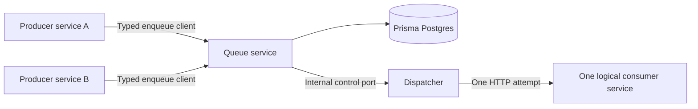

# Summary

Prisma Composer will provide a first-party queue capability for durable,
at-least-once work delivery on Prisma Cloud. It consists of a Queue Module and an
always-running dispatcher driver. Version one stores messages in Prisma Postgres
and pushes each queue's batches over authenticated HTTP to one statically wired
Composer consumer service. Any number of application services may produce to the
same queue. A later phase may add publish and subscribe as a separate capability
without changing this queue delivery contract.

## Prototype status

The first walking skeleton is implemented. It deliberately proves the narrowest
durable path before the full version-one contract:

- `defineQueues` creates the static typed queue catalogue.
- `queues` provisions one Postgres database and the queue service.
- `queueProducer` gives application services a typed `send` client.
- `queueConsumer` and `serveQueues` register typed handlers on an application
  service.
- `queueDispatcher` runs separately, claims one message with a lease, pushes it
  to one consumer, and completes or releases it.
- Each queue definition can set `maxAttempts` and a serializable fixed retry
  delay. The queue service persists the exact next availability time and moves
  exhausted messages into a terminal failed state.
- `examples/queues` proves one Compute service can produce and consume its own
  messages through the durable queue, including a real fail-once retry.

The prototype does not yet implement batches, exponential retry, failed-message
inspection and replay, pause and resume, operational data, or OpenTelemetry. The
detailed requirements below remain the target design, not a claim about the
current implementation.

# Context

The primary consumers are application engineers building Prisma Apps who need
background work without operating a separate queue product. Consumer implementers
need a typed, Cloudflare-like handler model. On-call engineers need durable state
and clear attempt history when a message is delayed, retried, or delivered more
than once.

This project starts with work queues, not publish and subscribe. Any number of
producer services may enqueue work, but each queue has exactly one logical
consumer service. A service may consume several queues, and the deployment target
may run several replicas of that service, but replicas are not separate Composer
consumer registrations. Different required outcomes belong on different queues
until publish and subscribe is designed as a separate capability.

## At a glance

Each producer receives a typed client through `service.load()` and commits a
message to the Queue Module. A dispatcher claims available messages from Postgres
and pushes a bounded batch to the queue's one consumer service. A successful
result completes the message; a failed or missing result makes it available for a
later attempt according to the queue's retry policy.



Every attempt for a queue goes to the same logical consumer service. Runtime
replicas may share requests behind that service endpoint, but the queue topology
contains one queue-to-consumer edge.

## Problem

Composer has reusable modules for scheduled work, storage, streams, and email, but
no durable work queue. Applications can call a service directly, but this couples
the caller to the callee's availability and gives the application no durable
retry, backpressure, or attempt history.

Prisma Compute is request-oriented and may scale to zero. Postgres can persist
messages and coordinate competing dispatchers, but it cannot by itself wake a
suspended Compute service when a new message or delayed retry becomes available.
The design therefore needs an explicit dispatcher lifecycle as well as durable
message state.

The authoring experience should feel familiar to Cloudflare Queues while delivery
uses a Google Cloud Tasks style HTTP push. Application code must not know about
database rows, leases, dispatcher instances, service URLs, or authentication
keys.

## Approach

The queue capability is composed from ordinary Composer primitives. The Queue
Module owns a Prisma Postgres database and a queue service. It exposes a typed
producer port and an internal dispatch-control port. A separate dispatcher driver
depends on the control port and the application-owned consumer port for each
queue. This remains target-specific functionality and does not add a queue
primitive to Composer core.

A queue definition is static TypeScript data shared by the producer client,
consumer contract, and handler helper. It contains the payload schema and the
delivery policy that must be known at deployment. Consumer registrations are
also part of the static Composer graph, with exactly one consumer binding for each
queue. Operational message state, attempts, availability times, and leases are
durable database state; consumer code and deployment configuration are not stored
in the database.

Queue payloads must be JSON-compatible values. A payload may contain at most
128 KiB after JSON serialization and UTF-8 encoding. Schema validation runs
before this byte-size check, and either failure rejects the enqueue without
creating a message row. Queue envelope metadata does not count toward the
payload limit. Applications should store larger values elsewhere and enqueue a
reference to them.

Each delivery contains at most the queue's configured batch size, which defaults
to 10 messages and accepts values from 1 through 100. The complete encoded HTTP
request, including envelope metadata, may not exceed 1 MiB. The dispatcher stops
adding messages when either bound is reached, never splits one message across
requests, and does not wait for a batch to fill before dispatching available
work.

Each delivery is a bounded HTTP request. The dispatcher atomically claims
available messages with a lease, commits the claim, and only then calls the
consumer. It never holds a database transaction open while application code
runs. The consumer timeout defaults to 30 seconds and accepts values from 1
through 50 seconds. The lease is not separately configurable; it lasts for the
consumer timeout plus 30 seconds. Lease expiry recovers work after a dispatcher
or consumer failure. Version one does not expose renewable leases or heartbeats
to consumer code.

The consumer records per-message acknowledgement and retry decisions in memory
while it handles the batch. When the handler finishes, its helper returns every
decision in the response to the dispatcher's original HTTP request. The dispatcher
then commits the results in one short transaction. An ordinary thrown handler
error preserves decisions already recorded and retries undecided messages. A
timeout aborts the dispatcher's request but does not release the lease. A timeout,
invalid or lost response, or process crash applies no decisions, so the leased
batch becomes available again after lease expiry.

One dispatcher driver remains running at all times. It serves every queue owned by
the Queue Module and processes due work without producer or web traffic. It drains
while work is available, then sleeps until the earliest known availability time
with a bounded fallback interval. Postgres remains the source of truth behind the
Queue Module's control port, so an enqueue wake signal may reduce latency but is
never required for correctness. ⚠️ **OF1** (always-running dispatcher support)
The Prisma Cloud target must support keeping one dispatcher instance running;
the driver must not emulate durability with `waitUntil` or a chain of
self-requests.

Each queue has one queue-wide concurrency limit, which defaults to 10 and accepts
values from 1 through 100. One slot represents one active batch HTTP request,
regardless of how many messages the batch contains. Every slot targets the
queue's one logical consumer service. The dispatcher stops claiming when every
slot is in use and resumes when a request finishes or a lease expires. A timed-out
request releases its slot, but its messages remain leased until expiry. Version
one has no zero-value pause or per-replica capacity settings.

Version one makes no message ordering guarantee. The dispatcher may prefer
currently available messages by availability time and creation order when
claiming work, but this is an implementation detail rather than a consumer
contract. Concurrent batches, retries, lease expiry, and replay can all cause a
later message to finish before an earlier one. Consumers must not depend on
first-in-first-out or per-key ordering.

The initial delivery is attempt one. A queue defaults to five maximum attempts
and accepts values from 1 through 100; version one does not support unlimited
attempts. The dispatcher increments the attempt count in the same transaction
that claims the message. A claim therefore consumes an attempt even if the
dispatcher fails before the consumer receives the request. Producer validation
and enqueue failures do not consume attempts.

Retry delays are static policy data built with `fixedBackoff` or
`exponentialBackoff`; arbitrary user callbacks are not accepted.
`exponentialBackoff` defaults to a five-second initial delay, a 15-minute
maximum, a factor of two, and equal jitter. For a calculated exponential limit
`d = min(max, initial × factor^(failed attempt - 1))`, no jitter waits exactly
`d`, full jitter selects from zero through `d`, and equal jitter selects from
`d / 2` through `d`. `fixedBackoff` uses the same delay after every failed
attempt. Delay values use one-second precision and must be from one second
through 24 hours. An exponential maximum cannot be shorter than its initial
delay, and its finite factor must be from 1.1 through 10. The helpers return
serializable descriptors, and invalid values fail while loading the graph. The
dispatcher calculates and persists each message's exact next availability time
once; restart does not recalculate it.

A consumer may call `message.retry({ delay: "30s" })` to replace the queue
policy with one concrete delay for that message's next attempt. The delay must
be from one second through 24 hours. It does not reset the attempt count or
change the queue policy. A plain `message.retry()`, thrown error, timeout,
invalid response, or lost response uses the queue policy. The override takes
effect only when the dispatcher receives and commits the consumer's valid
response.

Retention for an active message is measured from its original enqueue time and
does not reset on retry. It defaults to seven days and accepts values from one
hour through 30 days. When that period ends, an available, delayed, or retrying
message enters the terminal failed state with reason `expired` instead of being
silently deleted. Expiry during an active consumer request does not interrupt
the handler: a valid acknowledgement still completes the message, while a retry
or missing result produces the expired failure.

Completed payloads are removed immediately. Their metadata and attempt history
remain for 24 hours by default, configurable from immediate deletion through
seven days. Failed records retain their payloads for replay for 30 days by
default, configurable from one through 90 days. Terminal retention starts when
the message enters the completed or failed state. A message and its attempt
history are deleted together after that period. Replay creates a new message
with a new active retention period.

After the configured maximum attempts, a message enters an immutable terminal
failed state in its original queue and is no longer eligible for dispatch. Version
one does not route exhausted messages into a separate dead-letter queue. A
separate operational port can replay one retained failed message at a time. Replay
validates the original payload against the current queue schema and creates a new,
immediately available message with a new identifier, zero attempts, the current
retry policy, and a `replayedFrom` link. The original failed record remains
unchanged. The replay operation is durably idempotent.

The same separately wired operational port provides paginated failed-message
inspection and graceful queue pause and resume controls. A pause transaction is
a durable barrier for new claims: a claim committed before the pause may still
be delivered, but no claim may commit after the pause does. Enqueue remains
available, active HTTP requests and leases continue, valid results are committed,
and retry and retention clocks keep advancing. Resume wakes the dispatcher to
drain accumulated work within the normal concurrency limit. Both operations are
idempotent. Runtime control state is durable, not deployment configuration.

Failed-message listing returns metadata only: identifier, enqueue and failure
times, failure reason, attempt count, last consumer, retention expiry, and replay
status. Looking up one failed message returns its typed payload, full attempt
history, consumer and timing data for each attempt, safe error summaries, and
replay links. Payload access is therefore an explicit privileged operation and
never part of a list response. Listing uses an opaque cursor, defaults to 50
records, permits at most 100, and orders by descending failure time followed by
message identifier. It can filter by failure time range, failure reason, replay
status, and last consumer. Version one does not provide offset pagination,
payload search, or arbitrary query filters.

For version one, the Queue Compute service exposes current queue status and
recent activity through its separately wired operational RPC-over-HTTP port. A
Composer service wired to that port receives a typed client and the existing
per-binding service key; unwired callers are rejected. A later Prisma Console or
control-plane adapter can consume this contract, but that integration is outside
this phase. The Queue Module does not store general-purpose metric time series or
export customer-facing Prometheus or OpenTelemetry metrics in this phase.

Queue status returns the authored queue name, `running` or `paused` state,
optional pause time, counts for available, delayed, leased, and retained failed
messages, active and maximum batch request concurrency, optional age in
milliseconds of the oldest available message, optional last activity time, and
an `asOf` time. Optional values are absent when they do not apply. Timestamps use
RFC 3339, and counts are non-negative integers.

The activity feed records normal enqueue and delivery work as batch summaries.
A delivery result reports acknowledged, retrying, and failed counts instead of
writing one successful event per message. Terminal message failure, expiry,
replay, pause, and resume are individual events. Per-message attempt history
remains available through failed-message detail rather than being duplicated in
the general feed.

Activity is stored in a dedicated `queue_activity` table in the Queue Module's
Postgres database. Common indexed fields carry the event identifier, queue,
event type, occurrence and expiry times, and optional batch, message, and
consumer identifiers; type-specific safe metadata is stored separately from
those filter fields. Whenever an event describes a durable queue mutation, the
event and mutation commit in the same transaction. Activity is retained for
seven days by default, configurable from one through 30 days. Expired activity
is excluded from API results even before asynchronous physical cleanup. Activity
never contains message payloads.

Every activity event has an opaque identifier, authored queue name,
discriminating type, and RFC 3339 occurrence time. The supported types and
additional fields are:

- `enqueued`: message count.
- `delivery_started`: batch identifier, consumer identifier, and message count.
- `delivery_result`: batch and consumer identifiers, duration in milliseconds,
  acknowledged, retrying, and failed counts, and one of `valid_response`,
  `handler_error`, `timeout`, `network_error`, `http_error`, or
  `invalid_response`.
- `message_failed`: message identifier, attempt count, and failure reason.
- `message_expired`: message identifier and enqueue time.
- `message_replayed`: original and new message identifiers.
- `queue_paused` and `queue_resumed`: no additional fields.

Activity listing uses an opaque cursor, orders newest first, returns 50 events by
default and at most 100, and filters by occurrence time range, event type,
consumer identifier, and message identifier. It does not provide payload or
arbitrary text search.

Anonymous product telemetry over OpenTelemetry is required from version one so
the Prisma team can observe aggregate queue use and failures. It contains no
payloads or customer-visible identifiers, and telemetry export failure never
blocks enqueue, delivery, acknowledgement, retry, replay, pause, or resume. This
anonymous telemetry is emitted on a best-effort basis after the related durable
transaction commits. It is not stored in `queue_activity` and is separate from
the operational data returned through the operational port.

Anonymous counters cover messages enqueued, delivered, acknowledged, retried,
failed, expired, and replayed, plus queue pauses and resumes. Histograms cover
serialized payload size, batch size, queue wait time, consumer request duration,
and attempt number. Rate-limited internal error events carry only the operation,
normalized error code, Queue Module version, runtime, and Queue Module-owned
stack frames. Allowed attributes are operation, outcome, failure reason, retry
algorithm, runtime, and module version. Workspace, project, stage, queue,
message, batch, consumer, URL, payload, user error text, and user-code stack data
are forbidden.

Dedicated consumer Compute services are the documented default because they
isolate scaling, failures, and logs from the web application. An existing
Composer web service may instead be the queue's one logical consumer. The
application provisions each queue's consumer before the dispatcher and wires its
delivery port into the driver. A consumer may also depend on the Queue Module's
producer port, including for the same queue it consumes. Separating the queue
service from the dispatcher preserves this order and avoids a dependency cycle:
queue service, then consumer services, then dispatcher.

Version two may add a statically declared external HTTPS endpoint with
queue-specific request authentication. Runtime self-registration is outside the
current design.

The selected authoring foundation separates pure queue definitions from Composer
nodes. `defineQueues` creates only a static typed catalog. Standalone
`queueProducer` and `queueConsumer` factories derive a producer dependency and a
consumer exposure contract from that catalog. The `queues` factory creates the
infrastructure Module, while `queueDispatcher` creates the separate delivery
driver. `serveQueues` is the consumer runtime adapter that turns typed handlers
into a Fetch handler; it provisions nothing. The fixed-backoff queue definition
syntax is implemented; batch handling and the remaining signatures stay open.

> _Illustrative — names and exact syntax remain part of the authoring API design:_
>
> ```ts
> const thumbnails = defineQueue({
>   message: type({ imageId: "string" }),
>   retry: {
>     maxAttempts: 5,
>     delay: exponentialBackoff({
>       initial: "5s",
>       max: "15m",
>       factor: 2,
>       jitter: "equal",
>     }),
>   },
> });
>
> const { thumbnails: queue } = service.load();
> await queue.send({ imageId: "image-123" });
>
> serveQueue(consumerService, thumbnails, async (batch) => {
>   for (const message of batch.messages) {
>     await createThumbnail(message.body);
>     message.ack();
>   }
> });
> ```

> _Illustrative — topology names and exact factory signatures remain part of the
> authoring API design:_
>
> ```ts
> const queues = provision(queueModule({ queues: { thumbnails } }));
> const worker = provision(thumbnailWorker, {
>   deps: { thumbnails: queues.thumbnails },
> });
> provision(queueDispatcher({ queues: { thumbnails } }), {
>   deps: {
>     control: queues.dispatch,
>     consumers: { thumbnails: worker.queue },
>   },
> });
> ```

# Requirements

## Functional Requirements

- **FR1. Typed queue definition.** An application can define a queue from a
  Standard Schema payload validator. The same definition types producer calls,
  consumer handlers, and delivery validation.
- **FR2. Typed producer binding.** Any number of services wired to the Queue
  Module may receive the same queue's typed client through `service.load()`. A
  successful enqueue response means the message is durably committed.
- **FR3. Durable source of truth.** Prisma Postgres stores messages, availability,
  attempt count, current lease, completion state, and enough failure information
  to explain retry decisions.
- **FR4. Static internal consumer.** Each queue is wired at deployment to exactly
  one logical Composer consumer service. One service may consume several queues.
  Wiring fails before execution when a queue has no consumer or its consumer does
  not expose the required contract.
- **FR5. Single-consumer delivery.** Every attempt for a queue is sent to its one
  logical consumer service. A successful attempt completes the message. Runtime
  replicas behind that service endpoint are not separate consumer registrations.
- **FR6. Flexible consumer placement.** A consumer may be a dedicated Compute
  service or an existing application Compute service. Documentation and examples
  use a dedicated service by default.
- **FR7. HTTP push.** The dispatcher invokes the queue's consumer through a
  bounded, authenticated HTTP request containing a batch of typed messages. The
  response carries one acknowledgement or retry decision for every message.
- **FR8. Safe claiming.** Concurrent dispatcher work cannot claim the same
  available message at the same time. Consumer application code runs outside the
  claim transaction.
- **FR9. At-least-once recovery.** A failed request, retry result, lost response,
  dispatcher failure, or expired lease can cause another attempt. The system does
  not claim exactly-once execution.
- **FR10. Retry scheduling.** Retry policy determines when a failed message
  becomes available and when automatic attempts stop. Retry state survives
  Compute restarts.
- **FR11. Static policy, durable operations.** Queue and consumer configuration
  are declared in TypeScript. Runtime message and attempt state is stored in
  Postgres.
- **FR12. Internal authentication.** Composer provisions authentication for every
  dispatcher-to-consumer edge. Application handlers do not receive or manage
  service credentials.
- **FR13. Local operation.** The Queue Module and wired consumer services run under
  `prisma-composer dev` with local durable storage and the same public producer and
  consumer contracts used after deployment.
- **FR14. Failure visibility.** Runtime logs and stored attempt data identify the
  queue, message, attempt number, consumer, outcome, and next retry time
  without logging the message body by default.
- **FR15. Traffic-independent dispatch.** The queue capability includes one
  dispatcher driver that remains running and processes new messages, delayed
  retries, and expired leases without application traffic.
- **FR16. Queue-wide concurrency.** Each queue permits 10 active batch HTTP
  requests by default and accepts a configured limit from 1 through 100. The
  dispatcher does not claim more work while all slots are in use. Every slot
  targets the queue's one logical consumer; version one does not configure
  per-replica concurrency.
- **FR17. Consumer enqueue.** A consumer may receive the typed producer binding
  for any queue, including the same queue it consumes, and enqueue follow-up work
  without creating a dependency cycle.
- **FR18. Retry exhaustion.** A message that reaches its maximum attempts becomes
  a terminal failed record in its original queue and is excluded from dispatch.
- **FR19. Failed-message replay.** A separately wired operational client can
  replay one retained failed message. Replay is idempotent, preserves the failed
  record, and returns a new message identifier linked to the original.
- **FR20. Unordered delivery.** Version one does not guarantee claim, delivery,
  or completion order. Consumers cannot depend on first-in-first-out or per-key
  ordering.
- **FR21. Bounded payload.** A queue accepts a JSON-compatible payload only when
  it passes the queue schema and its serialized UTF-8 body is at most 128 KiB.
  Rejection creates no message row.
- **FR22. Bounded batch.** A queue delivers 10 messages per batch by default and
  accepts a configured limit from 1 through 100. The encoded request remains at
  or below 1 MiB, may contain fewer available messages, and never splits a
  message.
- **FR23. Bounded consumer request.** A consumer request times out after 30
  seconds by default and accepts a configured timeout from 1 through 50 seconds.
  Its non-configurable lease lasts 30 seconds longer than that timeout, and a
  timeout does not release the lease early.
- **FR24. Bounded attempts.** A queue allows five attempts by default and accepts
  a configured maximum from 1 through 100. The initial delivery is attempt one,
  and every durable claim consumes one attempt.
- **FR25. Retry policy builders.** A queue retry delay is a serializable
  descriptor created by `fixedBackoff` or `exponentialBackoff`.
  `exponentialBackoff` supports no, full, and equal jitter and defaults to equal
  jitter. Delays range from one second through 24 hours, and exponential factors
  range from 1.1 through 10. Invalid descriptors and arbitrary delay callbacks
  fail graph loading.
- **FR26. Per-message retry delay.** A consumer can request a concrete delay from
  one second through 24 hours for one message's next attempt. The override
  changes neither its attempt count nor the queue policy and is applied only
  from a valid consumer response.
- **FR27. Message retention.** Active message age is measured from enqueue and
  does not reset on retry. Active retention defaults to seven days and ranges
  from one hour through 30 days; expiry creates a replayable terminal failure.
  Completed metadata defaults to 24 hours and ranges from immediate deletion
  through seven days. Failed records default to 30 days and range from one
  through 90 days. Completed payloads are removed immediately, and each terminal
  record is deleted with its attempt history after retention.
- **FR28. Failed-message administration.** A separately wired operational client
  can list retained failures without payloads, retrieve one failure with its
  typed payload and attempt history, select replay candidates, and replay one
  message at a time. Listing uses stable cursor pagination and filters for
  failure time, reason, replay status, and last consumer.
- **FR29. Queue runtime control.** The operational client can pause and resume a
  queue without changing its static topology or redeploying the application.
  Pause prevents later claims but accepts enqueue and lets already claimed work
  finish. Control state survives process restart, and both operations are
  idempotent.
- **FR30. Operational status and activity.** The Queue Compute service exposes
  current status and recent activity through a separately wired, typed
  RPC-over-HTTP client using Composer service-key authentication. Normal traffic
  is summarized by batch, while terminal failures, expiry, replay, pause, and
  resume are individual events. Activity retention defaults to seven days and
  ranges from one through 30 days. Durable activity and the queue mutation it
  describes commit together in the Queue Module database. Status reports queue
  state, message-state counts, concurrency use, oldest available message age,
  and observation time. Activity uses a stable discriminated event contract,
  cursor pagination, and filters for time, type, consumer, and message.
- **FR31. Anonymous product telemetry.** From version one, the queue capability
  exports anonymous counters for queue operations, histograms for size and
  timing, and rate-limited normalized internal errors through OpenTelemetry
  without message payloads or customer-visible identifiers.

## Non-Functional Requirements

- **NFR1. Composer architecture.** The feature uses existing Module, service,
  resource, dependency, and contract primitives. Composer core remains unaware of
  Prisma Cloud queues.
- **NFR2. Deterministic topology.** Each queue's single consumer registration and
  delivery edge are visible in the statically loaded graph. Version one performs
  no runtime service discovery.
- **NFR3. Runtime neutrality.** Public authoring and handler types do not expose
  Bun-only or Node-only types. Application code owns its build, and Composer does
  not bundle or transform it.
- **NFR4. Durable acknowledgement boundary.** The system never reports enqueue
  success before the message commit succeeds and never reports completion before
  the acknowledgement state is committed.
- **NFR5. Failure isolation.** A consumer or dispatcher crash cannot leave a
  message permanently unavailable. An expired lease eventually returns unfinished
  work to the available state.
- **NFR6. Idempotent consumption.** Documentation and APIs state that consumers
  must tolerate duplicate delivery. Message identifiers remain stable across
  attempts so application code can implement durable deduplication where needed.
- **NFR7. Bounded work.** One delivery attempt has an HTTP deadline no longer
  than 50 seconds and a lease exactly 30 seconds longer than that deadline.
  Version one does not allow a handler to extend its lease.
- **NFR8. Durable clock.** Dispatcher availability is a Prisma Cloud target
  property. Request-scoped `waitUntil`, self-invocation, and producer traffic are
  not accepted as the clock that makes due work progress.
- **NFR9. Telemetry isolation.** OpenTelemetry export is best-effort and cannot
  change or delay queue behavior. Anonymous telemetry contains no queue payload,
  message identifier, queue name, consumer URL, or user-provided error text.
  Internal error events are rate-limited and include only Queue Module-owned
  stack frames.

## Non-goals

- More than one logical consumer or subscription per queue, including publish and
  subscribe delivery of one message to every subscription. A future topic and
  subscription capability must not change the queue's single-consumer contract.
- Statically declared external HTTPS consumers in version one; these are the next
  planned phase.
- Dynamic consumer registration, discovery, or heartbeats.
- Exactly-once execution.
- Consumer-controlled renewable leases or jobs that outlive one HTTP request.
- Automatic dead-letter routing and separate dead-letter queue consumers.
- Persisting consumer code or application deployment configuration in Postgres.
- Runtime editing of queue policy.
- Persisting each individual acknowledgement through a callback while a consumer
  request is still running.
- Bulk replay of failed messages.
- Prisma Console or control-plane integration and a Queue Module-owned graphical
  interface.
- Customer-facing Prometheus or OpenTelemetry metrics and durable metric
  time-series storage in version one.
- Administrative operations beyond failed-message inspection, replay, pause and
  resume, and queue observability.
- Strict first-in-first-out or per-key message ordering.

# Acceptance Criteria

- [ ] **AC1.** A producer sends a schema-valid message, receives success only
      after commit, and the message remains available after all Queue Module Compute
      processes restart. Covers FR1–FR3 and NFR4.
- [ ] **AC2.** A producer attempts to send a schema-invalid message and then a
      schema-valid payload larger than 128 KiB. Each call returns the relevant
      typed validation failure without creating a message row. Covers FR1, FR2,
      and FR21.
- [ ] **AC3.** Two different producer services enqueue messages to the same queue.
      Its one wired consumer service receives every message, and each message is
      completed by one successful attempt. Covers FR2, FR4–FR7, and NFR2.
- [ ] **AC4.** Two dispatcher workers race for the same available messages and no
      message has two active leases. Covers FR8.
- [ ] **AC5.** A consumer finishes its side effect but its HTTP response is lost.
      The message is delivered again with the same message identifier and a higher
      attempt number. Covers FR9, NFR5, and NFR6.
- [ ] **AC6.** A dispatcher stops after committing a claim. After lease expiry,
      another dispatcher claims and delivers the message. Covers FR8, FR9, and NFR5.
- [ ] **AC7.** A retryable consumer result makes the message available at the time
      calculated from queue policy, and restart does not change that time. Covers
      FR10 and FR11.
- [ ] **AC8.** An unwired Compute service cannot invoke a queue consumer endpoint,
      while the wired dispatcher can. Covers FR12.
- [ ] **AC9.** The same example application, including multiple producers wired to
      one consumer, passes its conformance scenario under local development and a
      deployed stage. Covers FR13 and NFR1–NFR3.
- [ ] **AC10.** Delivery logs and attempt records explain a failed attempt and its
      next action without exposing the message body. Covers FR14.
- [ ] **AC11.** A consumer acknowledges some messages, requests retries for
      others, and returns one valid response. The dispatcher commits each result
      accordingly. If the handler throws an ordinary error before deciding every
      message, recorded decisions are preserved and undecided messages are
      retried. Covers FR7, FR9, and NFR4.
- [ ] **AC12.** With no producer or web traffic, a delayed retry becomes due and
      the dispatcher delivers it. Restarting the dispatcher does not prevent due
      work or expired leases from progressing. Covers FR15, NFR5, and NFR8.
- [ ] **AC13.** With a queue concurrency limit of ten, no more than ten batch HTTP
      requests to its one logical consumer are active at once. Covers FR5 and
      FR16.
- [ ] **AC14.** A consumer is wired to both a queue delivery contract and the same
      queue's producer binding. The application graph loads without a dependency
      cycle, and handling one message can durably enqueue follow-up work. Covers
      FR4 and FR17.
- [ ] **AC15.** A message reaches its maximum attempts and becomes terminal
      without further delivery. Replaying it twice with one logical replay request
      returns the same new message, whose attempts start at zero and whose
      `replayedFrom` points to the unchanged failed record. Covers FR18 and FR19.
- [ ] **AC16.** A delayed or retried message is overtaken by a later available
      message, and both complete without the consumer relying on their order.
      Covers FR20.
- [ ] **AC17.** With a configured batch size of 100 and enough available work,
      delivery stops at 100 messages or before adding the first message that
      would make the encoded request exceed 1 MiB. A smaller available set is
      dispatched without waiting for more messages. Covers FR22 and NFR7.
- [ ] **AC18.** A consumer exceeds its configured timeout. The dispatcher aborts
      the request, does not apply a result, and no dispatcher can claim the
      messages before the original lease expires. Covers FR9, FR23, NFR5, and
      NFR7.
- [ ] **AC19.** A queue configured with five maximum attempts repeatedly fails.
      Each durable claim increments the attempt count, including a claim followed
      by dispatcher failure before HTTP delivery. After attempt five fails, the
      message becomes terminal and is not claimed again. Covers FR3, FR18, and
      FR24.
- [ ] **AC20.** Fixed and exponential retry descriptors survive graph loading and
      deployment without carrying executable user code. A failed attempt stores
      one exact next availability time, and dispatcher restart does not change it.
      Values outside the supported delay and factor ranges fail graph loading.
      Covers FR10, FR11, and FR25.
- [ ] **AC21.** In one valid batch response, one message requests a 30-second
      retry and another uses the queue policy. Their exact next availability
      times reflect those separate decisions, while both attempt counts remain
      unchanged by scheduling. Covers FR7, FR10, and FR26.
- [ ] **AC22.** An available or delayed message reaches its active retention
      limit without exhausting its attempts. It becomes failed with reason
      `expired`, remains inspectable and replayable during failed retention, and
      is deleted with its attempt history when that period ends. Covers FR18,
      FR19, and FR27.
- [ ] **AC23.** A consumer acknowledges a message after its active retention
      deadline passes during the request. The message completes, its payload is
      removed immediately, and its metadata and attempt history are deleted
      after completed retention. A retry under the same timing instead produces
      an expired failure retaining its payload. Covers FR7, FR18, and FR27.
- [ ] **AC24.** A pause races with a claim. A claim committed first may finish,
      while no claim commits after the pause. Producers continue enqueueing
      without consuming attempts. After process restart the queue remains paused;
      resume wakes dispatch and both repeated controls return success. Covers
      FR15, FR24, and FR29.
- [ ] **AC25.** Failed-message listing returns the documented metadata without
      payloads. Looking up one listed identifier returns its typed payload,
      attempts, consumers, safe error summaries, and replay links. An unwired
      service can access neither operation. Covers FR12 and FR28.
- [ ] **AC26.** Failed-message listing returns 50 newest records by default and
      never more than 100. Following its opaque cursor across equal failure times
      produces each matching record once in stable order. Every documented
      filter narrows the results without inspecting payloads. Covers FR28.
- [ ] **AC27.** Queue activity emits the documented anonymous OpenTelemetry
      counters, histograms, and normalized internal errors without forbidden
      attributes or user-code stack data. An unavailable exporter does not delay
      or fail queue operations, and repeated internal errors are rate-limited.
      Covers FR31 and NFR9.
- [ ] **AC28.** Enqueue and delivery of one batch creates batch-level operational
      activity with message and outcome counts rather than one success event per
      message. A terminal failure, replay, pause, and resume each create an
      individual event. Covers FR28–FR30.
- [ ] **AC29.** Operational activity survives Queue Compute restart, excludes
      events after the configured retention deadline even before physical
      cleanup, and never returns a message payload. Covers FR30.
- [ ] **AC30.** Status for a paused queue with available, delayed, leased, and
      failed messages returns the authored queue name, pause time, exact
      non-negative state counts, active and maximum concurrency, oldest available
      age, last activity time, and `asOf`. Empty optional values are absent.
      Covers FR29 and FR30.
- [ ] **AC31.** A transaction that commits a queue mutation also commits its
      operational activity event; rolling back the mutation leaves neither visible.
      Activity filtering uses indexed queue, time, type, consumer, batch, and
      message fields without inspecting payloads. Covers FR30 and NFR4.
- [ ] **AC32.** Activity listing returns the 50 newest matching events by default
      and never more than 100. Following its opaque cursor produces every event
      once in stable order. Every event validates against its documented
      discriminated shape and every supported filter narrows results. Covers
      FR30.

# References

- [Guiding principles](../../docs/design/01-principles/guiding-principles.md)
- [Architectural principles](../../docs/design/01-principles/architectural-principles.md)
- [ADR-0016: A Module has the same boundary as a service](../../docs/design/90-decisions/ADR-0016-a-module-has-the-same-boundary-as-a-service.md)
- [ADR-0020: Scheduled work is a driver, not a resource](../../docs/design/90-decisions/ADR-0020-scheduled-work-is-a-driver-not-a-resource.md)
- [ADR-0030: RPC callers use an auto-provisioned service key](../../docs/design/90-decisions/ADR-0030-rpc-callers-verified-with-an-auto-provisioned-service-key.md)
- [ADR-0037: Service RPC calls carry an idempotency key](../../docs/design/90-decisions/ADR-0037-service-rpc-calls-carry-an-idempotency-key.md)
- [Connection contracts](../../docs/design/10-domains/connection-contracts.md)
- [Google Cloud Tasks task model](https://cloud.google.com/tasks/docs/reference/rest/v2/projects.locations.queues.tasks)
- [Cloudflare Queues delivery guarantees](https://developers.cloudflare.com/queues/reference/delivery-guarantees/)
- [PostgreSQL `SELECT`](https://www.postgresql.org/docs/current/sql-select.html)

# Deployment validation

The walking skeleton is deployed as `queues-demo`. Its separate dispatcher
service remained active without direct requests, claimed five messages from the
queue service, and pushed all five to the application consumer. This validates
the target's always-running Compute pattern for the prototype. A deployed
fail-once message also moved from failed attempt one to successful attempt two
under the persisted five-second fixed retry policy. Restart recovery and the
remaining retry algorithms stay part of the full version-one work.
