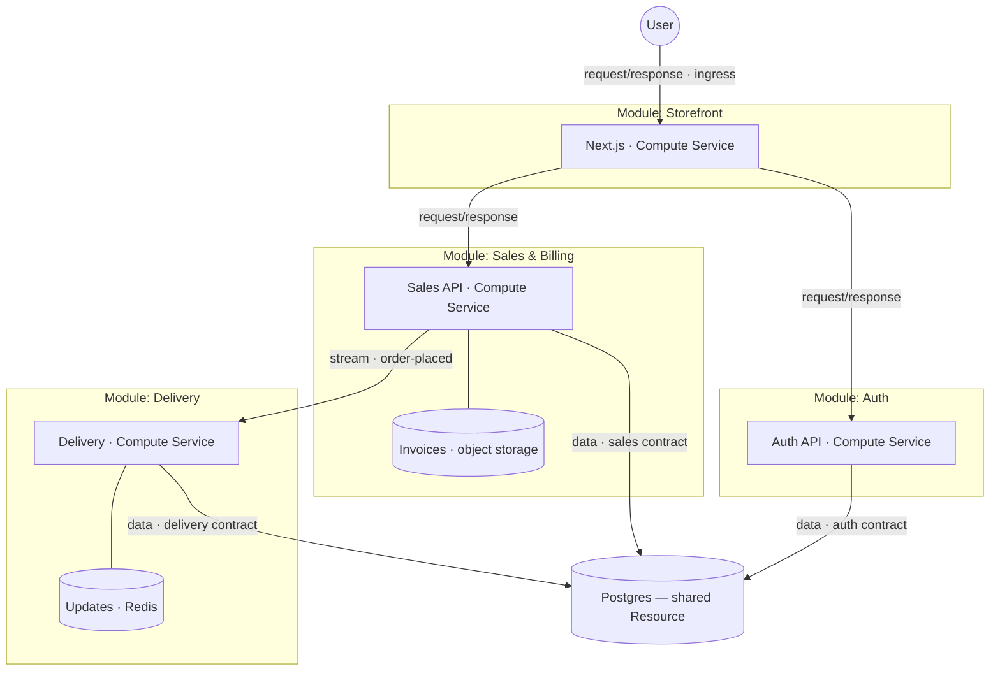

# Prisma Compose

**Prisma Compose** is a TypeScript framework for building and deploying
applications composed of components. You build a **Prisma App** by composing
**Modules** with Prisma Compose. A component — a Module — owns its Services and
Resources and exposes typed **Inputs** and **Outputs**; you connect one Module's
Outputs to another's Inputs, and at runtime Prisma Compose injects the dependencies
that satisfy them. The whole app is itself a Module — the outermost one — and that
is what you deploy.

From that structure the framework derives your application's dependency graph and
uses Alchemy to provision and deploy it. Deployment targets like Prisma Cloud plug
in as extension packs, so you can deploy the same application to any of them.

There's no infrastructure configuration to write or maintain.

## Example App

Take an online store: a **storefront** the public browses, a **sales** service
that records orders, a **delivery** service that reacts when an order is placed,
**auth**, and a **Postgres** database the services share. In a Prisma App each of
those is a component, and the edges between them are connections you declare in
code.

## Modules

Each box above is a **Module**: a bounded context that owns some code and data and
is reachable only through a typed boundary. Because nothing reaches inside except
through that boundary, every dependency between Modules is an explicit edge in the
graph. A Module is scale-invariant — it composes recursively, and the whole
application is just the outermost Module — so the root needs no special construct.

A Module wraps two kinds of thing. **Services** are the units that run code — an
HTTP API, the Next.js storefront, a background worker. **Resources** are the
stateful things it depends on: Postgres is first-class, and anything else (object
storage, a cache, a queue) comes in as an Alchemy resource surfaced as a typed
capability.

You can see this in the diagram: every Module has a Compute Service, Sales also
owns a private invoices store, and Delivery a Redis instance for its live updates.
Those private Resources sit inside the boundary, so they never become edges between
Modules — only the shared Postgres, used by several Modules at once, does.

> A Module is a bounded context in the ports-and-adapters (hexagonal) sense — it
> reaches the world only through typed ports, which is exactly what its Inputs and
> Outputs are. The name is the one the neighbouring ecosystems already use for a
> composable, boundary-owning unit: a Nest or Angular module, a Terraform module.

## Connections

A Module declares **Inputs** for what it needs and **Outputs** for what it offers;
a connection joins one Module's Output to another's Input. There are two kinds.

**Communication** is one Module calling another — either **request/response** (the
storefront calls the sales API) or a **stream** (sales emits *order-placed*, and
delivery consumes it).

**Data** is a Module reading and writing a Postgres Resource. The data Input carries
a **contract** — a Prisma Next description of exactly the tables and columns the
Module may touch — and a Postgres satisfies the connection only if it meets that
contract. In the store, one Postgres is shared by sales, delivery, and auth, but
each owns a separate slice named by its own contract. The instance is shared; the
data boundaries are not, and each one stays a visible edge rather than a hidden
reach into another Module's tables.

## Topology

The wired-up graph of Modules, Resources, and connections is the **topology**.
The framework infers it from your TypeScript and emits it as a standalone artifact —
one you or an agent can query from the CLI without deploying anything.

## From code to a running app

Prisma Compose spans three planes and **lowers** your model down through them:

- **Authoring** — what you write: Modules, Services, Resources, connections.
- **Provisioning** — the framework turns the topology into an Alchemy resource
  graph, and Alchemy's engine provisions it, run from your machine or your CD
  pipeline.
- **Hosting** — what actually runs. On Prisma Cloud, each Service becomes Prisma
  Compute, the shared Postgres becomes one managed database, and a stream becomes
  a durable stream.

Prisma Cloud is one hosting target, shipped as an extension pack — the core knows
nothing about it, and a different target plugs in the same way. Because the target
supplies each Resource's implementation, that implementation is substitutable: the
same Module runs against managed Postgres in the cloud and a local one in
development, with no change to your code.

## Decisions

- **Prisma Compose owns composition and borrows everything beneath it.** The Module
  model and the topology are its own; provisioning is Alchemy, data contracts are
  Prisma Next, hosting is Prisma Cloud. It rebuilds none of them.
- **Thin core, fat targets.** The core is the Module / Input / Output model and the
  lowering machinery, nothing more. Everything specific to a deployment target
  lives in a swappable pack, and the core never branches on where you deploy.
- **Your code is the source of truth.** The topology is read out of your
  TypeScript and type-checked, so it can't drift from a config you maintain on the
  side.
- **No globals.** Application code never reads `process.env` or looks a service up
  by name. Every resource a Module uses arrives as an injected, typed dependency.
- **Agent-first and realtime-first.** The topology is explicit, machine-readable,
  and queryable, so agents and people reason about it directly. Streaming and
  async are first-class from the start, not bolted onto request/response later.

## Status

The design lives in `docs/design/`; this page is the short version. Core,
extension packs, and the `prisma-compose` deploy CLI are implemented under
`packages/`, and the example apps under `examples/` deploy with
`prisma-compose deploy` / `prisma-compose destroy` (see
[`docs/design/10-domains/deploy-cli.md`](docs/design/10-domains/deploy-cli.md)).

- **Purpose and goals** — [`docs/design/00-purpose/`](docs/design/00-purpose/)
- **Principles** — [guiding](docs/design/01-principles/guiding-principles.md),
  [architectural](docs/design/01-principles/architectural-principles.md)
- **Domain model** — [glossary](docs/design/03-domain-model/glossary.md),
  [domain map](docs/design/03-domain-model/domain-map.md),
  [layering](docs/design/03-domain-model/layering.md)
- **Worked example** — [`docs/design/02-example-app/`](docs/design/02-example-app/)
- **Inspirations** —
  [`docs/design/04-inspirations/`](docs/design/04-inspirations/) (Alchemy, Convex,
  and others)
- **Reading order** — [`docs/design/README.md`](docs/design/README.md)
