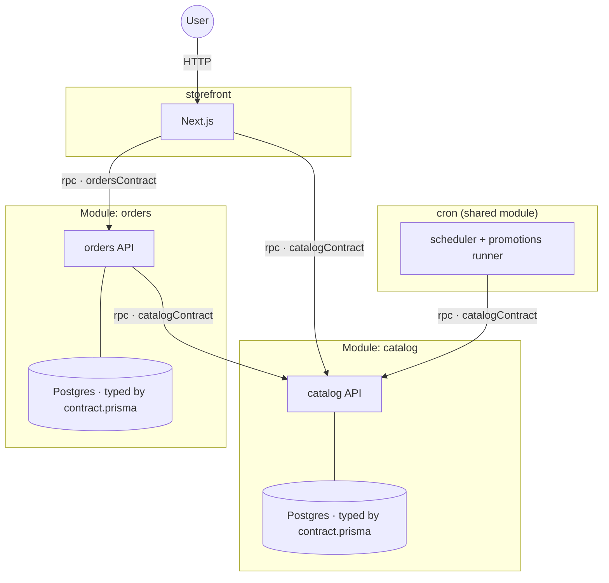

# Prisma Composer

**The fastest, most reliable way to build an app with your agent.** Start from
scratch and deploy the whole thing — services, databases, and the wiring
between them — to Prisma Cloud in minutes.

Prisma Composer is a TypeScript framework for apps made of more than one
piece. You declare each service and what it depends on — other services,
databases, schedules, secrets — compose them into a **Prisma App**, and
`prisma-composer deploy` provisions all of it. There is no infrastructure
configuration to write or maintain.

## Start with the skill

Composer is built to be driven by an agent, so the first thing to do is give
your agent the skill:

```sh
npx skills add prisma/composer --skill prisma-composer
```

That's the whole setup. Your agent now knows the entire API and arrives
prepped with the **building blocks** it can snap together — ready-made
Modules for scheduled jobs, blob storage, and event streams, alongside the
ones you write. Ask it for what you want ("a Next.js storefront calling an
orders API with its own Postgres, deployed to a staging stage") and let it
compose.

Three properties are why this works, rather than producing a plausible app
that doesn't run:

- **Modules snap together.** A capability arrives as a Module that owns its
  own internals and exposes a typed port. Adding scheduled jobs or a blob
  store is a couple of lines of composition — not an integration your agent
  has to invent.
- **Everything is typechecked.** A dependency wired to the wrong producer, a
  missing RPC handler, a config value of the wrong shape — none of it
  compiles. Your agent's mistakes get caught by `tsc` in seconds, not by a
  broken deploy ten minutes later.
- **Deploys are deterministic.** One command, no infrastructure config to
  hallucinate, and re-running it converges instead of drifting.

The same material, written for humans, is in the [guides](#getting-started).

## Two rules shape everything

- **Your code never reaches for its environment.** No `process.env`, no URLs.
  Every dependency arrives typed, through one call — which is also why any
  environment (production, a staging copy, a test) is just different injected
  values.
- **The framework never bundles or transforms your code.** You build; the
  deploy assembles what you built.

## What it looks like

A service declares its dependencies; app code receives them from
`service.load()`:

```ts
// service.ts — the declaration: pure data
export default compute({
  name: 'storefront',
  deps: { catalog: rpc(catalogContract) },   // "I call catalog's API"
  build: nextjs({ module: import.meta.url, appDir: '..' }),
});

// app code — load() returns a client typed by that contract
const { catalog } = service.load();
const { products } = await catalog.listProducts({});
```

The root module is the app — provision the pieces, wire the typed ports:

```ts
export default module('store', ({ provision }) => {
  const catalog = provision(catalogModule);                       // owns its own Postgres
  const orders = provision(ordersModule, { deps: { catalog: catalog.rpc } });
  provision(storefrontService, { deps: { catalog: catalog.rpc, orders: orders.rpc } });
});
```

That's [`examples/store`](examples/store/) — four components and their edges,
deployed with one command:



Each box is a **Module**: a boundary that owns some code and data and is
reachable only through typed ports. catalog and orders each own their own
Postgres — a [Prisma Next](https://github.com/prisma/prisma-next)-typed one,
with migrations applied at deploy — and the root never sees them; the only
edges are the exposed, contract-typed RPC ports. Because nothing reaches
inside a boundary, every dependency in the app is an explicit,
compiler-checked edge.

## Getting started

```sh
pnpm add @prisma/composer @prisma/composer-prisma-cloud arktype
```

Start with **[Getting started](docs/guides/getting-started.md)** — an empty
directory to a deployed two-service app, plus how to port an app you already
have.

| Guide | Covers |
| --- | --- |
| [Getting started](docs/guides/getting-started.md) | Your first app end to end; porting an existing Node or Next.js app |
| [Building an app](docs/guides/building-an-app.md) | Contracts, databases (plain + Prisma Next-typed with migrations), reusable Modules, cron/storage/streams, config, secrets |
| [Testing](docs/guides/testing.md) | Unit tests with `mockService`, integration tests with `bootstrapService` |
| [Deploying and operating](docs/guides/deploying.md) | Stages, destroy, CI, how apps behave in production |

## Examples

Complete, deployable apps under [`examples/`](examples/):

| Example | Demonstrates |
| --- | --- |
| [pn-widgets](examples/pn-widgets/) | The minimal app: one service + one Prisma Next-typed Postgres |
| [storefront-auth](examples/storefront-auth/) | Next.js frontend + API service, a reusable Module owning its database, secrets |
| [store](examples/store/) | Four modules, typed databases with migrations, the shared cron module |
| [cron](examples/cron/) | Scheduled jobs: `defineSchedule` + `serveSchedule` + the cron module |
| [storage](examples/storage/) | The S3-backed blob store module |
| [streams](examples/streams/) | Durable append-only event streams over storage |

## Building blocks and extensions

A **Module** is the unit of reuse: it owns its internals and exposes a typed
port, so composing one is a couple of lines and never an integration you have
to invent. Three ship inside `@prisma/composer-prisma-cloud` today — `cron`
(scheduled jobs), `storage` (S3-backed blobs), and `streams` (durable event
streams) — alongside the Modules you write yourself.

An **extension** is a package that brings its own Modules, resources, or
deploy target. The convention is an npm package named `prisma-composer-*` —
that name is how you (and your agent) find one. The ecosystem is new: the
first-party set above is the whole catalogue today, and it's growing.

The agent-facing version of the guides lives in [`skills/`](skills/) and
installs with `npx skills add prisma/composer --skill prisma-composer`.

## Design & internals

For contributors — the design record, not required reading for building apps:

- **Purpose and principles** — [`docs/design/00-purpose/`](docs/design/00-purpose/),
  [`docs/design/01-principles/`](docs/design/01-principles/)
- **Domain deep dives** — [`docs/design/10-domains/`](docs/design/10-domains/)
  (core model, contracts, module composition, config, deploy CLI, testing)
- **Decisions** — [`docs/design/90-decisions/`](docs/design/90-decisions/) (the ADR index)
- **Reading order** — [`docs/design/README.md`](docs/design/README.md)
- **Platform footguns** — [`gotchas.md`](gotchas.md)
