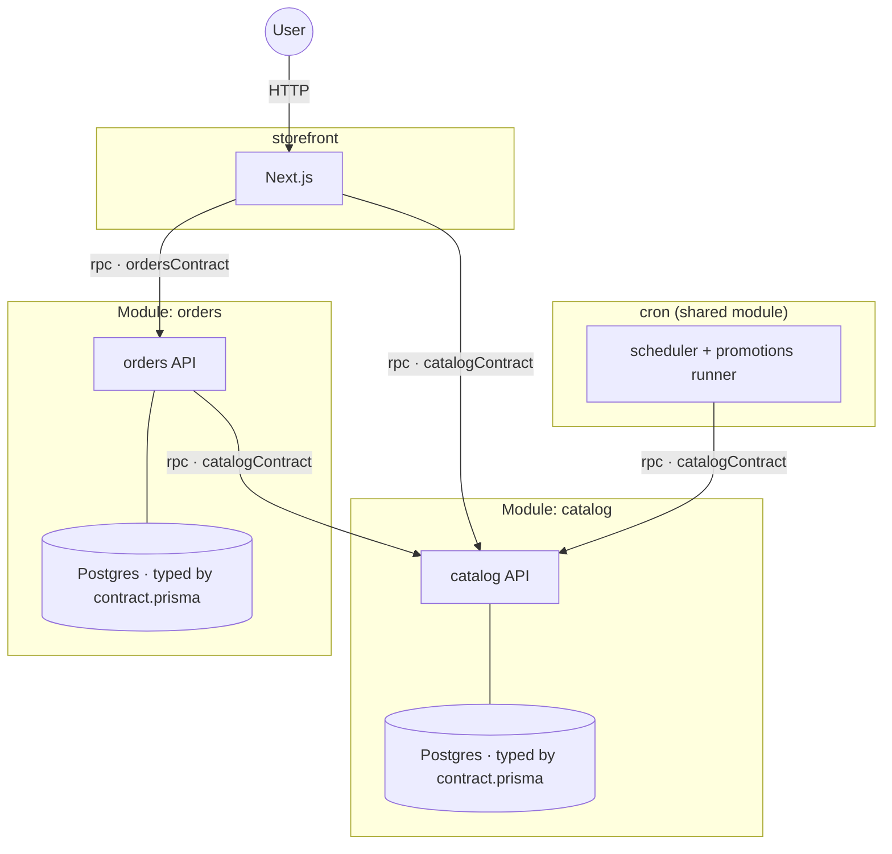

# Prisma Composer

**Prisma Composer** is a TypeScript framework for building and deploying
applications composed of components. You build a **Prisma App** by composing
**Modules**: a Module owns its services and resources and exposes typed ports;
you connect one Module's outputs to another's inputs, and at runtime the
framework injects the dependencies that satisfy them. The whole app is itself
a Module — the outermost one — and that is what you deploy.

From that structure the framework derives your application's dependency graph
and provisions it on Prisma Cloud (Compute + Prisma Postgres). There's no
infrastructure configuration to write or maintain — and the framework never
bundles or transforms your code: you build it, the deploy assembles what you
built.

## What it looks like

A service declares its dependencies; app code receives them from one place,
`service.load()` — never `process.env`, never a URL:

```ts
// service.ts — the declaration: pure data
export default compute({
  name: 'storefront',
  deps: { catalog: rpc(catalogContract) },
  build: nextjs({ module: import.meta.url, appDir: '..' }),
});

// app code — load() returns a typed client for the contract
const { catalog } = service.load();
const { products } = await catalog.listProducts({});
```

The root module is the app — provision the pieces, wire the typed ports:

```ts
export default module('store', ({ provision }) => {
  const catalog = provision(catalogModule);                       // owns its own Postgres
  const orders = provision(ordersModule, { deps: { catalog: catalog.rpc } });
  provision(storefrontService, { deps: { catalog: catalog.rpc, orders: orders.rpc } });
});
```

That's [`examples/store`](examples/store/) — four components and their edges,
deployed with one command:



Each box is a **Module**: a boundary that owns some code and data and is
reachable only through typed ports. catalog and orders each own their own
Postgres internally — the root never sees them; the only edges are the
exposed, contract-typed RPC ports. Because nothing reaches inside a boundary,
every dependency in the app is an explicit, compiler-checked edge.

## Getting started

```sh
pnpm add @prisma/composer @prisma/composer-prisma-cloud arktype
```

Follow **[Getting started](docs/guides/getting-started.md)** — empty directory
to a deployed two-service app.

| Guide | Covers |
| --- | --- |
| [Getting started](docs/guides/getting-started.md) | Your first app: contract → service → root module → deploy |
| [Building an app](docs/guides/building-an-app.md) | Contracts, databases (plain + Prisma Next-typed), reusable Modules, cron/storage/streams, config params, secrets, builds |
| [Testing](docs/guides/testing.md) | Unit tests with `mockService`, integration tests with `bootstrapService` |
| [Deploying and operating](docs/guides/deploying.md) | Stages, destroy semantics, CI, production behavior |

## Examples

Complete, deployable apps under [`examples/`](examples/):

| Example | Demonstrates |
| --- | --- |
| [pn-widgets](examples/pn-widgets/) | The minimal app: one service + one Prisma Next-typed Postgres |
| [storefront-auth](examples/storefront-auth/) | Next.js consumer + API producer, a reusable Module owning its database, secrets |
| [store](examples/store/) | Four modules, typed databases with migrations, the shared cron module |
| [cron](examples/cron/) | Scheduled jobs: `defineSchedule` + `serveSchedule` + the cron module |
| [storage](examples/storage/) | The S3-backed blob store module |
| [streams](examples/streams/) | Durable append-only event streams over storage |

## For agents

A condensed version of the guides ships as an installable agent skill:

```sh
npx skills add prisma/composer --skill prisma-composer
```

See [`skills/`](skills/).

## Design & internals

For contributors — the design record, not required reading for building apps:

- **Purpose and principles** — [`docs/design/00-purpose/`](docs/design/00-purpose/),
  [`docs/design/01-principles/`](docs/design/01-principles/)
- **Domain deep dives** — [`docs/design/10-domains/`](docs/design/10-domains/)
  (core model, contracts, module composition, config, deploy CLI, testing)
- **Decisions** — [`docs/design/90-decisions/`](docs/design/90-decisions/) (the ADR index)
- **Reading order** — [`docs/design/README.md`](docs/design/README.md)
- **Platform footguns** — [`gotchas.md`](gotchas.md)
