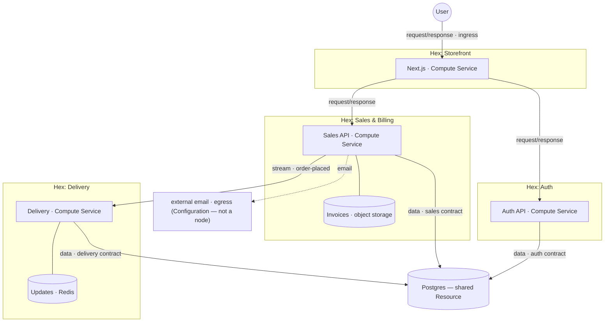

# Example app (anchor)

A fictional e-commerce app, used to keep design discussions concrete. It exercises
every core piece of the model: **Hexes** wrapping **Services** and **Resources**,
both connection styles (request/response and stream), a Postgres shared across
Hexes and carved by data contracts, private Resources owned inside a Hex, and an
external dependency that lives as **Configuration** rather than a node.

## The app

- A **Storefront** (Next.js) — the public site.
- **Sales & Billing** — an internal HTTP API the storefront calls to record orders.
  It owns a private **invoices** store (object storage) and emails receipts through
  an external provider it doesn't provision.
- **Delivery** — its own HTTP service; reacts to placed orders and pushes live
  status updates, backed by a private **Redis**.
- **Auth** (BetterAuth-style) — owns the auth tables, exposes an auth API.
- One **Postgres**, shared by Sales, Delivery, and Auth — each owning its own slice.

## Topology

Solid edges are connections in the topology. The dashed email edge is an
**egress** — it leaves the graph, so it's Configuration on the Sales Service, not a
node.

## Decomposition

Each Hex is a bounded context wrapping a Service (its code) plus any private
Resources. Storefront and Auth are single-Service Hexes; Sales and Delivery each
own a private Resource alongside their Service.

| Hex | Services | Private Resources | Inputs | Outputs |
| --- | --- | --- | --- | --- |
| **Storefront** | Next.js | — | `sales` (r/r), `auth` (r/r) | `site` (r/r · **ingress**) |
| **Sales & Billing** | Sales API | Invoices (object storage) | `data` (TCP · *sales* contract); `email` (**egress** → Configuration) | `sales` API (r/r); `order-placed` (stream) |
| **Delivery** | Delivery API | Redis (live updates) | `data` (TCP · *delivery* contract); `order-placed` (stream) | `delivery` API (r/r · internal) |
| **Auth** | Auth API | — | `data` (TCP · *auth* contract) | `auth` API (r/r) |

Plus one shared **Resource**:

| Resource | Output |
| --- | --- |
| **Postgres** (shared) | `data` **Data Output** offering the contract hashes `{sales, delivery, auth}` — the **aggregate contract** |

## What the example demonstrates

- **All the node types.** Four **Hexes** (the bounded contexts) wrap **Services**
  (the code) and **Resources** (the shared Postgres, the invoices bucket, the
  Redis). **Configuration** — the email key — is not a node.
- **Both connection styles.** Storefront → Sales and Storefront → Auth are
  **request/response**; Sales → Delivery (*order-placed*) is a **stream**. Not
  everything is a stream.
- **The shared Postgres is carved by contracts.** Sales, Delivery, and Auth each
  hold their own Data Contract over the one Postgres. Its Data Output must satisfy
  the **aggregate** of the three; ownership overlap is prohibited; the cloud can
  verify it. Shared instance, but every data dependency is a visible edge.
- **Private Resources stay inside.** The invoices bucket and the Redis are owned
  within their Hex, so they never become cross-Hex edges — only the shared Postgres
  does. Boundaries live at the authoring plane.
- **Configuration leaves the graph.** Sales emails receipts through a provider it
  doesn't provision — an **egress** backed by an API key. That's Configuration on
  the Sales Service, so it's neither a node nor a topology edge; hence the dashed
  arrow, drawn outside every Hex.
- **Ingress vs internal.** Only Storefront's `site` Output is public ingress; the
  sales/auth/delivery APIs are internal request/response Outputs consumed by other
  Hexes.
- **Encapsulation by convention.** No Hex reads another's tables; cross-Hex needs go
  through an Output (an API, the *order-placed* stream), never the database. The
  recommended convention, not (yet) an enforced rule.
- **A Hex behaves like a Service.** Each is stateless and reprovisionable with typed
  I/O, so if Delivery grew enough to split internally, a nested Hex would wire
  exactly like the Service it replaced.

## How it lowers (sketch)

Per `layering.md`: each Service → a Compute service (bundle + manifest, an Alchemy
Platform); the shared Postgres → one Database (Environment:Database is 1:1) whose
schema satisfies the aggregate contract; the invoices bucket and the Redis → their
own Alchemy Resources (provider create/update/delete), provisioned per environment;
the `order-placed` stream → a Stream; each request/response edge → an endpoint +
injected typed client; each Data Input → a contract-scoped connection injected at
runtime (no `DATABASE_URL` in user code); the email key → `effect/Config` bound to
the Sales Service's environment. MakerKit emits the whole graph as the topology
artifact — Configuration and egress ride along as environment binding, not nodes.

## Open questions / deferred

- Whether Delivery needs a request/response Output at all, or is purely
  stream-driven — depends on the product.
- **Auth: Hex or external?** As modelled, Auth is a **Hex** that owns its tables. If
  instead you used a hosted BetterAuth you don't provision, it wouldn't be an
  external *node* — it'd be **Configuration** (an API key) as an egress on whatever
  Service calls it, or a thin Auth **Service** wrapping it. Which fits BetterAuth is
  TBD.
- Connection-method richness (pooled, WebSocket) is deferred; the example uses `TCP`
  throughout.
