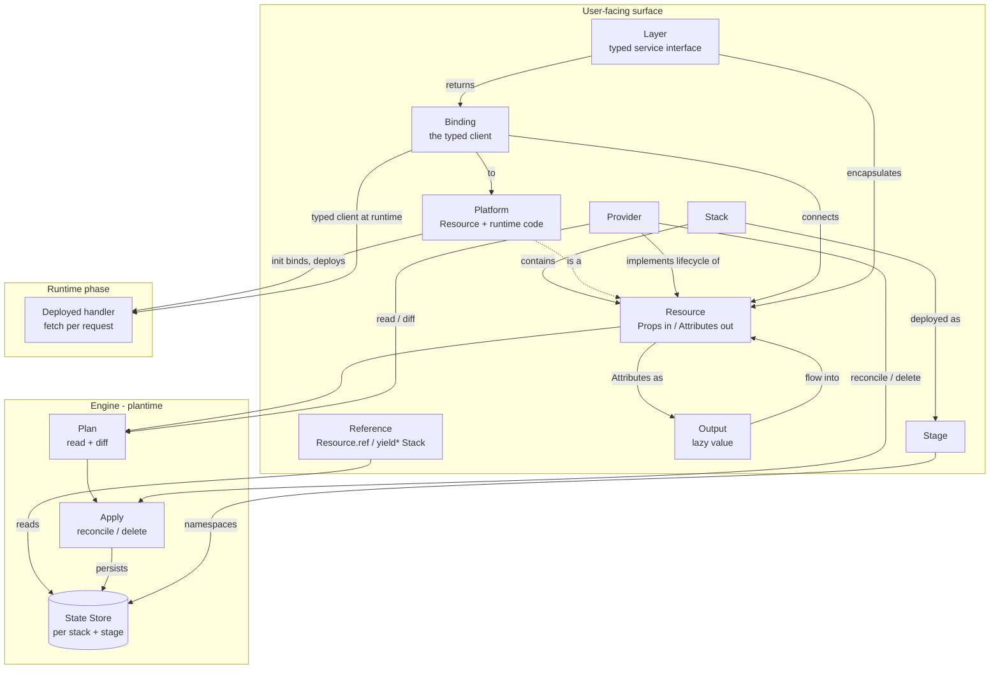

# Alchemy domain map (research)

This is a conceptual map of the **Alchemy v2** domain: the *things* that exist
and how they relate.

Source context: [Alchemy v2 docs](https://v2.alchemy.run) (local mirror: `./docs/`)

## Notes

- The user primarily thinks in: **Resources**, grouped into a **Stack**, deployed
  to a **Stage**, with **Bindings** handing typed clients to **Platforms**
  (compute), and **Layers** hiding infrastructure behind typed interfaces.
- The engine makes this work by:
  - **planning** (each Provider's `read` + `diff`) against the **state store**
  - **applying** (`reconcile` / `delete`) in dependency order, then persisting
    state
  - splitting **plantime** (deploy) from **runtime** (the handler), enforced in
    the type system via `RuntimeContext`
- **References** are the only cross-Stack / cross-Stage connector, and they read
  **persisted state** — they are concrete address coupling, not interface-based.
- A **Layer** is the interface/ports mechanism, but it operates **within a
  program**, not across deployed Stack boundaries. (This split — Layer vs
  Reference — is central to the MakerKit takeaways.)

## Open questions / assumptions

- Assumption: everything passes through the **engine + state store**; there is no
  separate "emit the graph and stop" path. The graph is a step inside apply.
- Assumption: a **Platform** is the only Resource kind that carries runtime code;
  passive resources (buckets, tables) do not.
