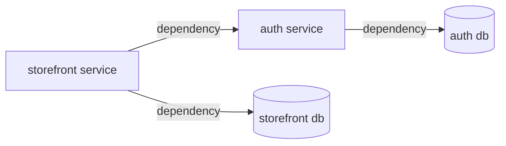
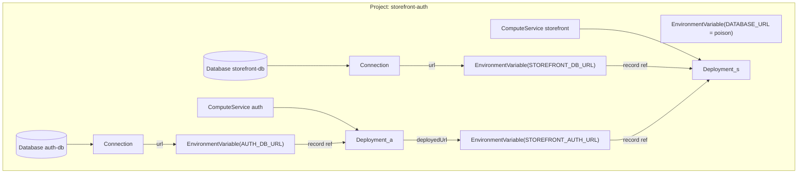

# Alchemy ↔ PDP — the resources we define and how they map

The Alchemy resource types `packages/prisma-alchemy` defines over the
[PDP data model](pdp-data-model.md), the mapping in both directions, and the
lowering graphs — including the correction that makes deploy ordering a property
of the dependency graph rather than luck.

## Placement: one Project per application, one Branch per stage

A PDP Project is a **shared config namespace** (every App on a branch snapshots
the same variable set into its versions) and a **shared lifecycle** (deletion
cascades). Prisma Composer's placement rule: **one Project per
Prisma Composer application** — all of an application's services are
Apps in that one Project, with the Module-provisioned Databases beside them.
Consequences, stated plainly:

- Config keys are namespaced per service by the pack's mapping (e.g.
  `AUTH_DB_URL`, `STOREFRONT_AUTH_URL`) — collisions are a naming concern the
  pack owns, not a reason to split projects.
- The Project is thereby also the **secret-visibility boundary**: every service's
  process env physically contains its co-located siblings' variables. One
  application = one trust domain; anything that must not be visible across
  services belongs in a different project (a different application).

Every deploy environment — production, staging, a per-PR preview — is a
**Branch** of that one Project
([ADR-0023](../90-decisions/ADR-0023-a-prisma-app-is-one-project-a-stage-is-a-branch.md)).
The default stage (no `--stage`) is production, at the Project level:
resources carry no `branchId` and no Branch exists for it. A **named stage**
(`--stage <name>`) is a Branch whose `gitName` is the stage name; every
resource the target provisions for that stage carries the Branch's id.
Resolving and creating the Branch — like the Project — happens **before**
Alchemy runs
([ADR-0024](../90-decisions/ADR-0024-a-stage-is-a-deploy-time-environment-resolved-to-project-and-branch.md));
Alchemy only diffs and provisions the resources *inside* a (Project, Branch),
never the container itself (see
[§ Stages and container resolution](#stages-and-container-resolution)).

## `DATABASE_URL` is forbidden — and actively poisoned

The platform writes `DATABASE_URL` / `DATABASE_URL_POOLED` templates pointing at
a project's default database — a convenience for hand-provisioned single
services, and precisely the kind of **implicit ambient config the framework
exists to eliminate**. The framework never reads it, never depends on it, and
makes reliance on it impossible: when the framework provisions a Project, it
**writes user-level
`DATABASE_URL` and `DATABASE_URL_POOLED` variables with a poison value** (`"-"` —
a garbage value any direct reader fails to connect with; the API rejects an empty
string, `"String must contain at least 1 character"`, verified at the R4 deploy
proof). User-set values
permanently override the platform templates (`wireDefaultDatabaseUrl` leaves
them untouched), so nothing deployed by the framework can ever quietly work
off the default again. Every database URL a service consumes is an explicit,
per-service
variable the pack's `serialize` writes under its own named key.

## The resource inventory

Each row is an Alchemy resource type we define (Alchemy has no built-in types —
it manages whatever a provider package registers).

| Our resource | PDP entity it manages | Props (in) | Outputs (out) | Notes |
| --- | --- | --- | --- | --- |
| `Project` | Project | workspaceId, name | id | **one per Prisma Composer application**; the poison `DATABASE_URL` variables are written at provision (see above) |
| `Database` | Database | projectId, name | id, connection info | one per Module-provisioned postgres resource; never the project default; created project-scoped, then attached to a named stage's Branch by a follow-up `PATCH` (the create body doesn't accept `branchId`) |
| `Connection` | database connection info | databaseId | url | direct/pooled endpoints; the url is written as the service's own named variable via the pack's `serialize` |
| `ComputeService` | App | projectId, name, region, branchId? | id | `branchId` in the create body targets a named stage's Branch directly; omitted, PDP attaches it to the Project's default (production) Branch |
| `EnvironmentVariable` | ConfigVariable | projectId, class, key, value, branchId? | id | production-class with no `branchId` on the default stage; preview-class with `branchId` on a named stage |
| `Deployment` | Deployment (ComputeVersion) + Promotion | computeServiceId, artifactPath, artifactHash, port, **environment** (the env-var records the version boots with — see the graphs below) | versionId, deployedUrl | provider reconcile: create version → upload tar.gz → start → poll until running → promote; `deployedUrl` read **post-promote** (create-time domain is a placeholder — PRO-200) |

What we deliberately do **not** model yet, and where it will bite:
**Promotion** as a standalone resource (the Deployment provider
auto-promotes; rollback is unexpressed), and non-default **Databases** with
contracts. **Branch** is now resolved and threaded (see
[§ Stages and container resolution](#stages-and-container-resolution)) — but
only as a container id carried in providers' `branchId` props; it is never an
Alchemy resource itself, since its lifecycle lives outside Alchemy
(ADR-0024).

## Stages and container resolution

`@internal/lowering` also hosts the **container-resolution client**
(`resolveContainer` / `deleteBranch`) the deploy CLI runs *before* the
generated stack, not through an Alchemy resource: `resolveContainer`
finds-or-creates the app's Project (oldest name match adopted) and, for a
named stage, its Branch (found by `gitName`, created if absent); `ensure:
false` makes it find-only, for `destroy`. It reuses the same Management API
client and the same adopt-oldest / tolerate-a-racing-409 idiom the state
store's own bootstrap uses
([ADR-0034](../90-decisions/ADR-0034-deploy-state-lives-in-the-stage-branch.md))
— the two resolve different things (deploy containers vs. the stage's state
database) through the same client and idiom. Once `destroy` has removed a
stage's members, the CLI removes the stage's state database
(ownership-verified) and `deleteBranch` then soft-deletes its Branch.

Deploy state keeps its existing shape — keyed per Alchemy `--stage`
(ADR-0034) — unchanged by this: under stage-as-branch, **the Project is the
stack and the Branch is the stage**
([ADR-0023](../90-decisions/ADR-0023-a-prisma-app-is-one-project-a-stage-is-a-branch.md)),
so a stage's effective identity is the pair (Project, Branch), and the
stage's state database lives inside that same Branch. The store's internal
logic is untouched.

## The mapping, both directions

- **Ours → PDP**: each resource's provider (`reconcile`/`delete`) calls the
  Management API; the table above is that mapping. One resource maps to one PDP
  entity except `Deployment`, which spans version-create + upload + start +
  promote (and therefore owns the env-snapshot moment).
- **PDP → ours**: `foundryVersionId`, `Promotion`, and Foundry's version record
  have no resource of ours; they are internal to the `Deployment` provider's
  behavior or unmodeled. **Branch** likewise has no Alchemy resource — it is
  resolved and its lifecycle managed by the CLI's container-resolution
  client, outside the Alchemy graph entirely (see
  [§ Stages and container resolution](#stages-and-container-resolution)).
  `serviceEndpointDomain` surfaces only as `Deployment.deployedUrl`.

## The lowering graphs

Lowering turns Prisma Composer's semantic graph into an Alchemy
resource graph. Arrows read "depends on / consumes a value from"; Alchemy
executes in dependency order and **runs unordered resources concurrently —
declaration order is never consulted** — so every ordering the framework's
semantics require must exist as an edge.

**Prisma Composer's graph** (what the user means):

**The Alchemy graph it lowers to** (one Project — the application):

How the pieces map:

- **The application** lowers to one `Project`, provisioned first, with the
  poison `DATABASE_URL` variables written immediately (nothing downstream can
  depend on the default).
- **Each service** lowers to a `ComputeService → Deployment` chain plus its own
  `Database → Connection`, whose url is written as that service's **explicitly
  named** variable — the same `serialize` path as any other config value.
- **The connection** lowers to two edges: the producer's `deployedUrl` flows
  into a named `EnvironmentVariable`, and that variable's **record reference
  flows into the consumer's `Deployment`** via its `environment` prop.
- Every `EnvironmentVariable` a Deployment boots with appears in its
  `environment` prop — database URLs and connection URLs alike — so the version
  depends on its config being written first.
- The Deployment's `port` prop rides the same seam: `serialize` resolves the
  service's `port` param from the typed Config and surfaces it in its outputs,
  and `deploy` routes the platform to it — so the routed port and the `PORT`
  the app binds trace to one value and cannot drift.

The `environment` prop is essential and mirrors PDP's own dataflow — the
version-create call literally contains the materialized env map, so the
environment is genuinely an input to a version (see the
[config lifecycle](pdp-data-model.md#the-config-lifecycle--what-is-resolved-when)).
The edge's job today is **ordering**: the variable write completes before
version-create, so the first version boots with a complete environment. Without
it the two race — the failure documented as PRO-211 in `gotchas.md`.

**Change propagation is a deferred follow-up, not yet wired.** The env-var
resource exposes only `{ id, key }`, so a *value* change (a rotated URL) does not
diff the consumer `Deployment`, and no new version is created. The intended fix is
provenance-based — the consumer depends on the **source node's** version, never on
the value or a hash of it (a hash of a secret is itself a leak, and persisting the
value would put a credential in Alchemy state). It is narrow in practice: promoted
service endpoints are stable across producer redeploys, so a wire's value rarely
moves, and true secrets are platform-sourced and rotate through the platform, not
this edge (see the [config/secret split](../03-domain-model/glossary.md#configuration--config-and-secrets)).

The framework's core constructs these edges when lowering a connection (the
`serialize` env-var records thread into `deploy` through the service SPI); no pack
author and no app author ever hand-wires them.

## Related

- [`pdp-data-model.md`](pdp-data-model.md) — the platform model these resources manage.
- [`../10-domains/core-model.md`](../10-domains/core-model.md) — the SPI that
  drives this lowering (three execution paths, phased service SPI).
- [`../10-domains/deploy-cli.md`](../10-domains/deploy-cli.md) § Stages and
  containers — the CLI pipeline step that drives the container resolution
  described here.
- [`../03-domain-model/glossary.md`](../03-domain-model/glossary.md) § compile
  target — the Alchemy substrate itself.
- [ADR-0023](../90-decisions/ADR-0023-a-prisma-app-is-one-project-a-stage-is-a-branch.md)
  / [ADR-0024](../90-decisions/ADR-0024-a-stage-is-a-deploy-time-environment-resolved-to-project-and-branch.md)
  — the decisions this section documents.
