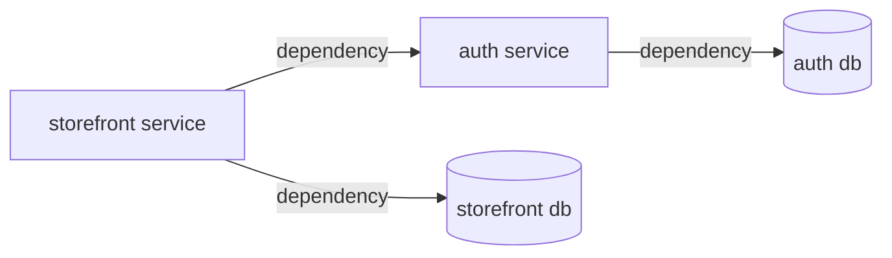
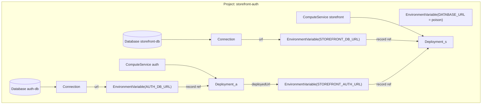

# Alchemy ↔ PDP — the resources we define and how they map

The Alchemy resource types `packages/prisma-alchemy` defines over the
[PDP data model](pdp-data-model.md), the mapping in both directions, and the
lowering graphs — including the correction that makes deploy ordering a property
of the dependency graph rather than luck.

## Placement: one Project per application

A PDP Project is a **shared config namespace** (every App on a branch snapshots
the same variable set into its versions) and a **shared lifecycle** (deletion
cascades). The Prisma App Framework's placement rule: **one Project per
Prisma App Framework application** — all of an application's services are
Apps in that one Project, with the System-provisioned Databases beside them.
Consequences, stated plainly:

- Config keys are namespaced per service by the pack's mapping (e.g.
  `AUTH_DB_URL`, `STOREFRONT_AUTH_URL`) — collisions are a naming concern the
  pack owns, not a reason to split projects.
- The Project is thereby also the **secret-visibility boundary**: every service's
  process env physically contains its co-located siblings' variables. One
  application = one trust domain; anything that must not be visible across
  services belongs in a different project (a different application).

## `DATABASE_URL` is forbidden — and actively poisoned

The platform writes `DATABASE_URL` / `DATABASE_URL_POOLED` templates pointing at
a project's default database — a convenience for hand-provisioned single
services, and precisely the kind of **implicit ambient config the framework
exists to eliminate**. The framework never reads it, never depends on it, and
makes reliance on it impossible: when the framework provisions a Project, it
**writes user-level
`DATABASE_URL` and `DATABASE_URL_POOLED` variables with a poison value** (`"-"` —
a garbage value any direct reader fails to connect with; the API rejects an empty
string, `"String must contain at least 1 character"`, verified at the R4 deploy
proof). User-set values
permanently override the platform templates (`wireDefaultDatabaseUrl` leaves
them untouched), so nothing deployed by the framework can ever quietly work
off the default again. Every database URL a service consumes is an explicit,
per-service
variable the pack's `serialize` writes under its own named key.

## The resource inventory

Each row is an Alchemy resource type we define (Alchemy has no built-in types —
it manages whatever a provider package registers).

| Our resource | PDP entity it manages | Props (in) | Outputs (out) | Notes |
| --- | --- | --- | --- | --- |
| `Project` | Project | workspaceId, name | id | **one per Prisma App Framework application**; the poison `DATABASE_URL` variables are written at provision (see above) |
| `Database` | Database | projectId, name | id, connection info | one per System-provisioned postgres resource; never the project default |
| `Connection` | database connection info | databaseId | url | direct/pooled endpoints; the url is written as the service's own named variable via the pack's `serialize` |
| `ComputeService` | App | projectId, name, region | id | PDP attaches it to the production branch implicitly |
| `EnvironmentVariable` | ConfigVariable | projectId, class, key, value, branchId? | id | we write production-class templates only |
| `Deployment` | Deployment (ComputeVersion) + Promotion | computeServiceId, artifactPath, artifactHash, port, **environment** (the env-var records the version boots with — see the graphs below) | versionId, deployedUrl | provider reconcile: create version → upload tar.gz → start → poll until running → promote; `deployedUrl` read **post-promote** (create-time domain is a placeholder — PRO-200) |

What we deliberately do **not** model yet, and where it will bite: **Branch**
(everything implicitly targets the production branch; the platform's
preview-class + branch-override structure is unmodeled — future
environments/stages work), **Promotion** as a standalone resource (the
Deployment provider auto-promotes; rollback is unexpressed), and non-default
**Databases** with contracts.

## The mapping, both directions

- **Ours → PDP**: each resource's provider (`reconcile`/`delete`) calls the
  Management API; the table above is that mapping. One resource maps to one PDP
  entity except `Deployment`, which spans version-create + upload + start +
  promote (and therefore owns the env-snapshot moment).
- **PDP → ours**: `foundryVersionId`, `Promotion`, Foundry's version record, and
  Branch have no resource of ours; they are internal to the `Deployment`
  provider's behavior or unmodeled. `serviceEndpointDomain` surfaces only as
  `Deployment.deployedUrl`.

## The lowering graphs

Lowering turns the Prisma App Framework's semantic graph into an Alchemy
resource graph. Arrows read "depends on / consumes a value from"; Alchemy
executes in dependency order and **runs unordered resources concurrently —
declaration order is never consulted** — so every ordering the framework's
semantics require must exist as an edge.

**The Prisma App Framework's graph** (what the user means):

**The Alchemy graph it lowers to** (one Project — the application):

How the pieces map:

- **The application** lowers to one `Project`, provisioned first, with the
  poison `DATABASE_URL` variables written immediately (nothing downstream can
  depend on the default).
- **Each service** lowers to a `ComputeService → Deployment` chain plus its own
  `Database → Connection`, whose url is written as that service's **explicitly
  named** variable — the same `serialize` path as any other config value.
- **The connection** lowers to two edges: the producer's `deployedUrl` flows
  into a named `EnvironmentVariable`, and that variable's **record reference
  flows into the consumer's `Deployment`** via its `environment` prop.
- Every `EnvironmentVariable` a Deployment boots with appears in its
  `environment` prop — database URLs and connection URLs alike — so the version
  depends on its config being written first.
- The Deployment's `port` prop rides the same seam: `serialize` resolves the
  service's `port` param from the typed Config and surfaces it in its outputs,
  and `deploy` routes the platform to it — so the routed port and the `PORT`
  the app binds trace to one value and cannot drift.

The `environment` prop is essential and mirrors PDP's own dataflow — the
version-create call literally contains the materialized env map, so the
environment is genuinely an input to a version (see the
[config lifecycle](pdp-data-model.md#the-config-lifecycle--what-is-resolved-when)).
The edge's job today is **ordering**: the variable write completes before
version-create, so the first version boots with a complete environment. Without
it the two race — the failure documented as PRO-211 in `gotchas.md`.

**Change propagation is a deferred follow-up, not yet wired.** The env-var
resource exposes only `{ id, key }`, so a *value* change (a rotated URL) does not
diff the consumer `Deployment`, and no new version is created. The intended fix is
provenance-based — the consumer depends on the **source node's** version, never on
the value or a hash of it (a hash of a secret is itself a leak, and persisting the
value would put a credential in Alchemy state). It is narrow in practice: promoted
service endpoints are stable across producer redeploys, so a wire's value rarely
moves, and true secrets are platform-sourced and rotate through the platform, not
this edge (see the [config/secret split](../03-domain-model/glossary.md#configuration--config-and-secrets)).

The framework's core constructs these edges when lowering a connection (the
`serialize` env-var records thread into `deploy` through the service SPI); no pack
author and no app author ever hand-wires them.

## Related

- [`pdp-data-model.md`](pdp-data-model.md) — the platform model these resources manage.
- [`../10-domains/core-model.md`](../10-domains/core-model.md) — the SPI that
  drives this lowering (three execution paths, phased service SPI).
- [`../03-domain-model/glossary.md`](../03-domain-model/glossary.md) § compile
  target — the Alchemy substrate itself.
