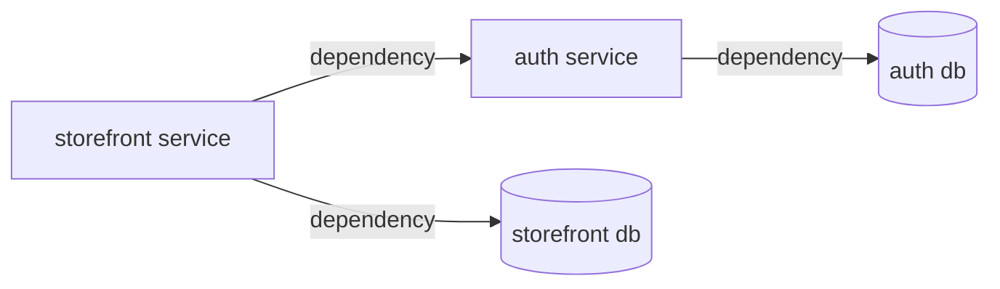
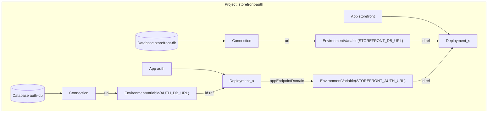

# Alchemy ↔ PDP — the resources we bind and how they map

The Alchemy resource types Composer lowers to over the
[PDP data model](pdp-data-model.md), the mapping in both directions, and the
lowering graphs — including the correction that makes deploy ordering a property
of the dependency graph rather than luck.

The postgres family (`Project`, `Database`, `Connection`) and the compute
family (`App`, `Deployment`, `EnvironmentVariable`) are **upstream alchemy's**
(`alchemy/Prisma`), not ours: Composer registers their providers and binds their
props. What `@internal/lowering` still owns is the artifact packager, the
buckets, `ServiceKey`, and the hosted state store.

## Placement: one Project per application, one Branch per stage

A PDP Project is a **shared config namespace** (every App on a branch snapshots
the same variable set into its versions) and a **shared lifecycle** (deletion
cascades). Prisma Composer's placement rule: **one Project per
Prisma Composer application** — all of an application's services are
Apps in that one Project, with the Module-provisioned Databases beside them.
Consequences, stated plainly:

- Config keys are namespaced per service by the pack's mapping (e.g.
  `AUTH_DB_URL`, `STOREFRONT_AUTH_URL`) — collisions are a naming concern the
  pack owns, not a reason to split projects.
- The Project is thereby also the **secret-visibility boundary**: every service's
  process env physically contains its co-located siblings' variables. One
  application = one trust domain; anything that must not be visible across
  services belongs in a different project (a different application).

Every deploy environment — production, staging, a per-PR preview — is a
**Branch** of that one Project
([ADR-0023](../90-decisions/ADR-0023-a-prisma-app-is-one-project-a-stage-is-a-branch.md)).
The default stage (no `--stage`) is production, at the Project level:
resources carry no `branchId` and no Branch is created for it — the CLI only
*reads* the Project's existing default Branch's id, which becomes the
Alchemy stage (the deploy-state scope, TML-3157). A **named stage**
(`--stage <name>`) is a Branch whose `gitName` is the stage name; every
resource the target provisions for that stage carries the Branch's id.
Resolving and creating the Branch — like the Project — happens **before**
Alchemy runs
([ADR-0024](../90-decisions/ADR-0024-a-stage-is-a-deploy-time-environment-resolved-to-project-and-branch.md));
Alchemy only diffs and provisions the resources *inside* a (Project, Branch),
never the container itself (see
[§ Stages and container resolution](#stages-and-container-resolution)).

## `DATABASE_URL` is forbidden — and left to the platform

The platform writes `DATABASE_URL` / `DATABASE_URL_POOLED` templates pointing at
a project's default database — a convenience for hand-provisioned single
services, and precisely the kind of **implicit ambient config the framework
exists to eliminate**. The framework never reads it and never depends on it.
Framework-provisioned Projects are created with `createDatabase: false`, so no
default database exists on them — but that alone does not keep the variable
away: the platform self-heals a missing `DATABASE_URL` template on the first
Compute deploy, wiring it from any ready database on the Project (default
first, then oldest) — on a Composer Project, one of the app's own databases.

So the framework claims the keys first. `application.provision` writes
`DATABASE_URL` and `DATABASE_URL_POOLED` (production and preview class,
project-level) with the placeholder value `"-"` via create-only calls
(`lowering/src/database-url-claim.ts`). The platform's writes are also
create-only, so whoever writes first wins permanently: on a fresh Project the
claim lands first and the self-heal never fires; on a Project whose variables
the platform already seeded, the claim gets a 409 and no-ops. The rows are
plain platform variables, never Alchemy resources — nothing enters deploy
state and upstream's `EnvironmentVariable` never owns them. Alongside the
claim, the authoring-side ban holds: `param.ts` and `secret.ts` reject both
names, so no Composer-declared row can carry one. Every database URL a
service actually consumes is an explicit, per-service variable the pack's
`serialize` writes under its own named key, inside the `COMPOSER_` namespace.

A service that reads `process.env.DATABASE_URL` behind the framework's back
therefore reads the placeholder `"-"` and fails loudly — or, on a Project the
platform seeded before the framework ever deployed to it, the platform's own
template ([deploying.md](../../guides/deploying.md) covers the leftover rows
and manual cleanup).

## The resource inventory

Each row is a resource type the lowering binds. The `Prisma.*` families are
upstream `alchemy/Prisma` classes (ADR-0048) — Composer registers them in its
provider collection and defines resources only where the upstream provider
has no support yet (buckets) or no Management API exists behind them.

| Resource (upstream `alchemy/Prisma`) | PDP entity it manages | Props (in) | Outputs (out) | Notes |
| --- | --- | --- | --- | --- |
| `Prisma.Project` | Project | name | projectId | **one per Prisma Composer application**; resolved by the CLI before Alchemy runs, so no lowering yields one |
| `Prisma.Database` | Database | project, name?, region, branchId? | databaseId, connection strings | one per Module-provisioned postgres resource; never the project default; a branch-attached database is created with `branchId` and no display name (upstream refuses the combination — see [deploying.md](../../guides/deploying.md)) |
| `Prisma.Connection` | database connection info | database, name | connectionId, directConnectionString | Composer binds the DIRECT string explicitly; upstream's `databaseUrl` is pooled-first |
| `Prisma.App` | App | project, displayName, regionId, branchId? | appId, appEndpointDomain | `branchId` targets a named stage's Branch; omitted, upstream attaches the App to the project's default (production) Branch. `appEndpointDomain` is available at provision — that is what a service's own origin is read from |
| `Prisma.EnvironmentVariable` | ConfigVariable | project, class, key, value (Redacted), branchId? | environmentVariableId | production-class with no `branchId` on the default stage; preview-class with `branchId` on a named stage. Values are write-only, so upstream re-applies the desired one on every deploy |
| `Prisma.Deployment` | Deployment (ComputeVersion) + Promotion | app, artifactPath, artifactContentType, portMapping, triggers, start, promote | deploymentId, appEndpointDomain | provider reconcile: create → upload tar.gz → start → poll until running → promote; `appEndpointDomain` read **post-promote** (create-time domain is a placeholder — PRO-200). It is replaced, not updated, when its artifact fingerprint or its `triggers` fingerprint moves |

What we deliberately do **not** model yet, and where it will bite:
**Promotion** as a standalone resource (the Deployment provider
auto-promotes; rollback is unexpressed), and non-default **Databases** with
contracts. **Branch** is now resolved and threaded (see
[§ Stages and container resolution](#stages-and-container-resolution)) — but
only as a container id carried in providers' `branchId` props; it is never an
Alchemy resource itself, since its lifecycle lives outside Alchemy
(ADR-0024).

## Stages and container resolution

`@internal/lowering` also hosts the **container-resolution client**
(`resolveContainer` / `deleteBranch`) the deploy CLI runs *before* the
generated stack, not through an Alchemy resource: `resolveContainer`
finds-or-creates the app's Project (oldest name match adopted) and, for a
named stage, its Branch (found by `gitName`, created if absent); `ensure:
false` makes it find-only, for `destroy`. It reuses the same Management API
client and the same adopt-oldest / tolerate-a-racing-409 idiom the state
store's own bootstrap uses
([ADR-0034](../90-decisions/ADR-0034-deploy-state-lives-in-the-stage-branch.md))
— the two resolve different things (deploy containers vs. the stage's state
database) through the same client and idiom. Once `destroy` has removed a
stage's members, the CLI removes the stage's state database
(ownership-verified) and `deleteBranch` then soft-deletes its Branch.

Deploy state keeps its existing shape — keyed per Alchemy `--stage`
(ADR-0034) — unchanged by this: under stage-as-branch, **the Project is the
stack and the Branch is the stage**
([ADR-0023](../90-decisions/ADR-0023-a-prisma-app-is-one-project-a-stage-is-a-branch.md)),
so a stage's effective identity is the pair (Project, Branch), and the
stage's state database lives inside that same Branch. The store's internal
logic is untouched.

## The mapping, both directions

- **Ours → PDP**: each resource's provider (`reconcile`/`delete`) calls the
  Management API; the table above is that mapping. One resource maps to one PDP
  entity except `Deployment`, which spans version-create + upload + start +
  promote (and therefore owns the env-snapshot moment).
- **PDP → ours**: `foundryVersionId`, `Promotion`, and Foundry's version record
  have no resource of ours; they are internal to the `Deployment` provider's
  behavior or unmodeled. **Branch** likewise has no Alchemy resource — it is
  resolved and its lifecycle managed by the CLI's container-resolution
  client, outside the Alchemy graph entirely (see
  [§ Stages and container resolution](#stages-and-container-resolution)).
  `serviceEndpointDomain` surfaces as `App.appEndpointDomain` (before the first
  deploy) and `Deployment.appEndpointDomain` (post-promote).

## The lowering graphs

Lowering turns Prisma Composer's semantic graph into an Alchemy
resource graph. Arrows read "depends on / consumes a value from"; Alchemy
executes in dependency order and **runs unordered resources concurrently —
declaration order is never consulted** — so every ordering the framework's
semantics require must exist as an edge.

**Prisma Composer's graph** (what the user means):

```mermaid
flowchart LR
  SF[storefront service] -- dependency --> AU[auth service]
  SF -- dependency --> SDB[(storefront db)]
  AU -- dependency --> ADB[(auth db)]
```

**The Alchemy graph it lowers to** (one Project — the application):

```mermaid
flowchart TB
  subgraph P [Project: storefront-auth]
    DBa[(Database auth-db)] --> Ca[Connection] -- url --> EVa["EnvironmentVariable(AUTH_DB_URL)"]
    DBs[(Database storefront-db)] --> Cs[Connection] -- url --> EVs["EnvironmentVariable(STOREFRONT_DB_URL)"]
    Sa[App auth] --> Da[Deployment_a]
    Ss[App storefront] --> Ds[Deployment_s]
    EVa -- id ref --> Da
    EVs -- id ref --> Ds
    Da -- appEndpointDomain --> EVu["EnvironmentVariable(STOREFRONT_AUTH_URL)"]
    EVu -- id ref --> Ds
  end
```

How the pieces map:

- **The application** lowers to one `Project`, resolved by the CLI before
  Alchemy runs. It provisions no variables of its own.
- **Each service** lowers to an `App → Deployment` chain plus its own
  `Database → Connection`, whose url is written as that service's **explicitly
  named** variable — the same `serialize` path as any other config value.
- **The connection** lowers to two edges: the producer's endpoint domain flows
  into a named `EnvironmentVariable`, and that variable's **id flows into the
  consumer's `Deployment`** through its `app` prop.
- Every `EnvironmentVariable` a Deployment boots with is threaded into its
  `app` — database URLs and connection URLs alike — so the deployment
  depends on its config being written first.
- The Deployment's `portMapping.http` rides the same seam: `serialize` resolves
  the service's `port` param from the typed Config and surfaces it in its
  outputs, and `deploy` routes the platform to it — so the routed port and the
  `PORT` the app binds trace to one value and cannot drift.

That ordering edge is essential and mirrors PDP's own dataflow — the
deployment-create call literally contains the materialized env map, so the
environment is genuinely an input to a deployment (see the
[config lifecycle](pdp-data-model.md#the-config-lifecycle--what-is-resolved-when)).
The edge's job is **ordering**: the variable write completes before
deployment-create, so the first deployment boots with a complete environment.
Without it the two race — the failure documented as PRO-211 in `gotchas.md`.

**Why the edge rides `app`.** Upstream's `Prisma.Deployment` has no
`environment` prop (Composer's deleted one did). Alchemy derives its dependency
graph from the resource references a prop's *value* is built from, so the
descriptor builds `app` as an Output over the app id AND every variable's id,
resolving to the app id itself: the graph gains the edges. It cannot ride
`artifactPath` (or any of upstream's other replacement-block props): the diff
reads that block as one unit and gives no opinion the moment any member is
unresolved — and a brand-new variable's reference IS unresolved at plan time —
which would skip the artifact comparison and silently drop a code change.
`compute/deployment-edge.ts` records the full argument and its test drives
upstream's real diff.

**Change propagation is wired through `Prisma.Deployment.triggers`.** The platform freezes a deployment's environment at create, so a *value* change (a rotated URL) reaches a running service only through a new deployment. The compute descriptor declares one trigger member per environment row, carrying the same `Redacted` value the row writes; upstream folds the resolved members into a salted fingerprint inside its own encrypted state and plans a replacement exactly when one moved (and conservatively when a member cannot be resolved at plan time because the producing resource is itself changing). Unchanged service → same fingerprint → reuse; changed value or artifact → replace. Because upstream resolves the actual values, a value re-issued under a stable resource identity (a connection rotated in place, a re-minted service key) moves the fingerprint too. No plaintext lands in state — the members are `Redacted` in props and only the salted hash is persisted. A platform variable a row merely POINTS at (operator-owned; Composer never reads its value) contributes a `<name>:updatedAt` member instead, read at preflight and carried across the CLI→Alchemy process boundary on the framework's preflight-transport channel, so an out-of-band rotation still ships a new deployment.

The framework's core constructs these edges when lowering a connection (the
`serialize` env-var records thread into `deploy` through the service SPI); no pack
author and no app author ever hand-wires them.

## Related

- [`pdp-data-model.md`](pdp-data-model.md) — the platform model these resources manage.
- [`../10-domains/core-model.md`](../10-domains/core-model.md) — the SPI that
  drives this lowering (three execution paths, phased service SPI).
- [`../10-domains/deploy-cli.md`](../10-domains/deploy-cli.md) § Stages and
  containers — the CLI pipeline step that drives the container resolution
  described here.
- [`../03-domain-model/glossary.md`](../03-domain-model/glossary.md) § compile
  target — the Alchemy substrate itself.
- [ADR-0023](../90-decisions/ADR-0023-a-prisma-app-is-one-project-a-stage-is-a-branch.md)
  / [ADR-0024](../90-decisions/ADR-0024-a-stage-is-a-deploy-time-environment-resolved-to-project-and-branch.md)
  — the decisions this section documents.
