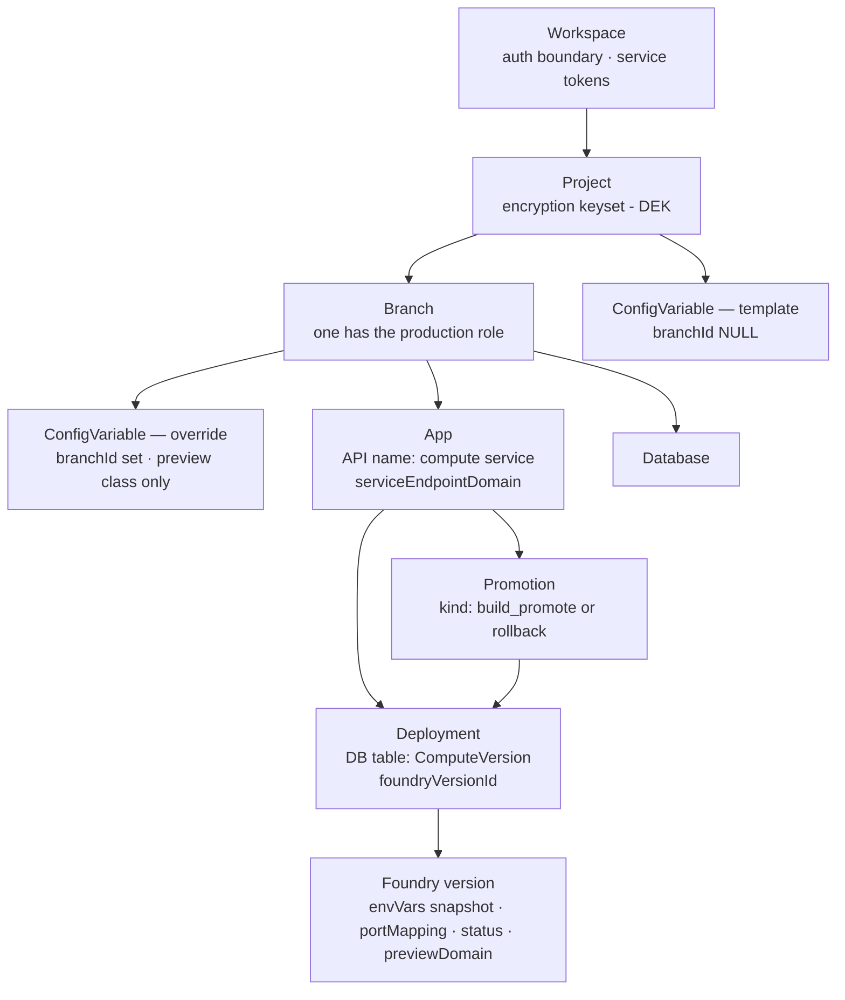

# PDP data model — as it pertains to the Prisma App Framework

The Prisma Data Platform's actual entity model, read from `pdp-control-plane`
source (schema: `prisma/schema.prisma`; behavior: `services/management-api/**`,
`packages/interactors/**`). This is the ground truth the
[Alchemy lowering](alchemy-lowering.md) maps onto. Scope: only what the
Prisma App Framework touches — compute, config, databases; billing/auth/SCM
omitted.

## The entity graph

Edge semantics, with the properties that matter to us:

- **Workspace → Project.** All API access is workspace-scoped (service token).
- **Project → Branch.** Every project has branches; one carries the production
  role (`PRODUCTION_BRANCH_ROLE`). The Prisma App Framework today only ever
  touches the production branch, implicitly.
- **Branch → App, Branch → Database.** Both are **branch-scoped** (composite FK
  `[branchId, projectId]`). An App **must be attached to a Branch to deploy** —
  version creation 422s otherwise (`resolveDeployEnvVars.ts`: "Attach the app to
  a Branch before creating a deployment").
- **Project → ConfigVariable (template), Branch → ConfigVariable (override).**
  `ConfigVariable` = `{ projectId, branchId?, class: production|preview, key,
  encryptedValue (AES-GCM under the project DEK), isManagedBySystem }`, unique on
  `(project, branch, class, key)`. `branchId NULL` is a project-level template;
  a set `branchId` is a branch-scoped override, **allowed only for the preview
  class** (CHECK constraint).
- **App → Deployment.** A Deployment is one immutable version of the app
  (`ComputeVersion` table); `foundryVersionId` links it to the runner's record.
- **App → Promotion → Deployment.** Promotion points the app's stable endpoint
  (`serviceEndpointDomain`) at a deployment; kinds `build_promote` and
  `rollback`; records `coldStartPerformed`.
- **Deployment → Foundry version.** PDP delegates execution to **Foundry**. The
  Foundry version stores `envVars`, `portMapping`, `previewDomain`, `status` —
  PDP's `GET /versions/:id` reads them back from Foundry.

## The config lifecycle — what is resolved when

This is the timing model the Prisma App Framework's graph must respect:

| Moment | What happens | Source |
| --- | --- | --- |
| default DB provisioned | the platform **writes** `DATABASE_URL` and `DATABASE_URL_POOLED` as ordinary project-level production-class ConfigVariable **templates** (user-set values win) | `compute-config/wireDefaultDatabaseUrl.ts` |
| any time | ConfigVariable rows are created/updated/deleted via the environment-variables API — **rows only; no effect on any existing version** | `routes/v1/environment-variables.ts` |
| **version create** | `materializeBranchEnvVars(app.branchId)` resolves the complete map — production branch → production templates; preview branch → preview templates merged with that branch's overrides (override wins) — decrypts it, and hands the **plain map to Foundry with the version**. The env is **frozen into the version** | `routes/v1/versions.ts` → `resolveDeployEnvVars.ts` → `compute-config/materializeBranchEnvVars.ts` |
| version start | boots the version; **no env re-resolution** | `routes/v1/version-handlers.ts` |
| promote | endpoint routed to the version; `serviceEndpointDomain` persisted. The domain returned at *create* time is a placeholder region — only the post-promote read is trustworthy (PRO-200) | `interactors/compute/service.ts` |

Consequences the Prisma App Framework designs around:

1. **A version's environment is a snapshot taken at version creation.** A config
   value that must be visible to a service's code has to exist as a
   ConfigVariable row *before* that service's version-create call (the failure
   mode when it doesn't is documented as PRO-211 in `gotchas.md`).
2. **Changing config requires a new version to take effect.** There is no
   restart-on-config-change and no live re-resolution; a late-written variable
   never reaches an existing version. Propagating a changed value (e.g. a
   producer's new URL) into a consumer therefore means creating a new consumer
   version — which the Alchemy graph does via a property diff (see
   [alchemy-lowering.md](alchemy-lowering.md)).
3. **`DATABASE_URL` is not a separate mechanism.** It is a system-written
   template flowing through the same materialization as user variables — a
   convenience for hand-provisioned single services. The Prisma App Framework
   forbids its use and poisons it at project provision (see
   [alchemy-lowering.md](alchemy-lowering.md#database_url-is-forbidden--and-actively-poisoned));
   every database URL a service consumes is an explicit, service-named variable.
4. **Branch + class is the platform's environments model** (production
   templates vs preview templates + per-branch overrides) — the natural
   substrate for the Prisma App Framework's future stages/environments story.

## Related

- [`alchemy-lowering.md`](alchemy-lowering.md) — the Alchemy resources we define
  over this model, and the lowering graphs.
- [`../03-domain-model/layering.md`](../03-domain-model/layering.md) — where the
  hosting plane sits in the Prisma App Framework's three-plane picture.
