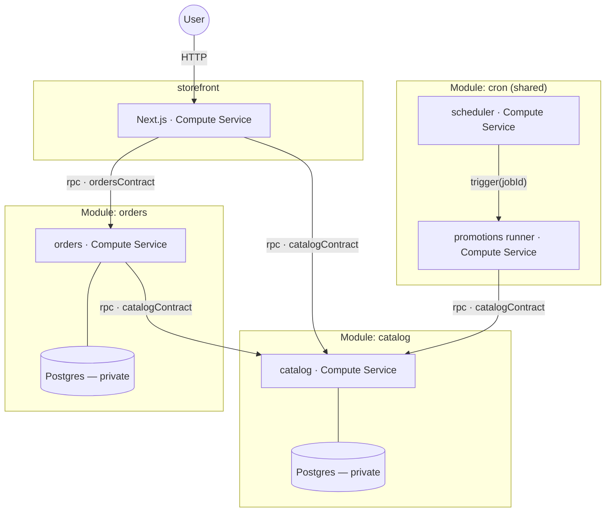

# store — Compose Coffee

A readable example Prisma App: a Next.js storefront, a **catalog** module, an
**orders** module, and the shared **cron** module rotating the special of the
day.



Each module owns its own Postgres; the only edges between components are the
typed RPC contracts. The whole composition is [module.ts](module.ts).

## What each piece shows

- [modules/catalog](modules/catalog) — a self-contained Module: a contract
  (`listProducts`/`getProduct`), a compute service, and a **Prisma
  Next-typed Postgres** it owns. The data schema is
  [contract.prisma](modules/catalog/contract.prisma); the deploy applies
  [migrations/](modules/catalog/migrations) before the service starts, and
  `load()` hands the server a typed client — queries like
  `db.orm.public.Product.where({ id }).first()`, no SQL, no row mapping.
  Consumers wire only the exposed `rpc` port.
- [modules/orders](modules/orders) — a Module with a **boundary input**: it
  owns its (also Prisma Next-typed) Postgres but declares `deps: { catalog }`,
  so whoever provisions it supplies a producer of `catalogContract`.
  `placeOrder` calls catalog to price the order at placement time.
- [modules/storefront](modules/storefront) — a real Next.js app. The page
  calls both typed clients; the Buy button is a server action that places an
  order.
- [modules/promotions](modules/promotions) + the shared
  `@prisma/compose-prisma-cloud/cron` module — **composition of a shared
  module**. promotions defines the schedule
  (`rotateSpecial: '30s'`) and the runner that maps the job id to
  `catalog.rotateSpecial()`; the root provisions `cron({ schedule, runner })`
  and wires `catalog.rpc` into its boundary like any other edge. The ★
  special on the menu moves every 30 seconds.

## Run it locally (no cloud)

```sh
pnpm dev   # from examples/store
```

Serves in-memory fakes of catalog and orders on loopback ports and runs
`next dev` against them — the same fakes the unit test injects via
`mockService` ([page.test.tsx](modules/storefront/app/page.test.tsx)).

## Deploy

```sh
pnpm deploy    # needs .env at the repo root (see examples/storefront-auth)
pnpm destroy
```
